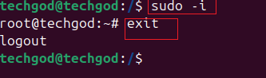

# File Permission and Access Rights
Linux operating is based on files and folder, hence the need to understand how to manage the file permission and ownrship is crucial. The knowledge empowers you to control access to files and directories, ensuring the security and integrity of your system.

In Linux,managing files and permissions and ownership is vital for controlling who can access,modify or execute files and directories.

### Numeric Representation of Permission
---
In linux,permissions are represnted using numeric values.Each permission is assigned a speific value.
Take a loo at the following:

- **No permissions** = 0
- **read permission** = 4
- **write permission** = 2
- **execute permission** = 1

NOTE: where permission is not given. it is represented by a hyphen (-). This shows the absence of a permission.

These values combined toghether represents the permission granted each user class.

 For example, full permssion to a file will enable read, write and execute funtion
  
 A read and write and execute: rwx =4+2+1 = 7

 A read and write: rw- = 4+2+0 = 6

 A read and execute: r-x = 4+0+1 = 5

These symbolic's **`rwx`** are assigned to either the owner of the file, a group that needs access to the file and then others. The following screen shots further explain this concept.

These permissions are assigned to user class in linux. The user class in linux are as follow:

- **Owner**: user or file creator
- **Group**: collection of users who share certain permission.
- **Others**: Anyone else who can access the system but is not the owner or belong to group.
 
The first character represents either it is a file or folder. `-` or `d` 
The next three represnts the user

The next three after the user is the group

The next three after the user represent others
The following screen shot, shed light on the aforementioned permissions.

The different user class are captured below, showing the permission assigned to each based on the file each file.

rwx--owner has full access

rwx--group also has full access

r-x--other can only read and execute

 

files and folder are captured here and represented by `-` and `d` respectively.

The screen shows the owner/user and the group the owner belongs to .

## File permission and command.
To manage file permissions and ownership, linux provides several command.

# Chmod command: 
This command allow you to modify file permissions. Tou can use both symbolic or numeric representation to assign permission.
1. create a file: touch script.txt

The image above show that it is a file, and

 the owner/user has read and write permission but can not eexcute `rw-`

 the group had only read right `r--` and 
 
 others have also read only right `r--`.

 Now to update the permission, we use the `chmod` command
 
 From the above, the permission of the user, group and other have been upgraded to include execute. so comparing the pernmission we now have

 User from `rw-` to `rwx`

 group from `r--` to `r-x`

 other from `r--` to `r-x`

 The same result can be achieved by using the number approach.  screen shot below
 

The above shows removal of execute profile frmom the file and then adding it back using the number approach.
The 755 is achieved by using 

user: r + w + x = 4 + 2+ 1  = 7

group: r + x + - = 4 + 1 = 5

others: r + x + - = 4 + 1 = 5

Exaxmple 2: 
creat a file touch, with only the user with full permission.

The above show the change of mode from 644 to 777 numeric and the impact alphabetic change on the permission from `rw-r--r--` to `rwxrwxrwx`.

# chown command
This command allows you to change the onwership of files and directories. The command looks like

To change user and group to John and developer, we use the 
chown john:developer filename.txt

chown was using changing the owner and group name.

## Superuser Priviledges
Superuser privileges is necessary to perform important task. To switch to the root user, we use the command sudo -i
 
This shows switching bewtween the techgod user and root user, using the sudo -i command.

# User management on linux
 Creating a user named Joe is simply using the command `sudo adduser name`

 

 # Granting administrative priviledges

 User created do niot have any admin priviledged, to granta use admin priviledge, we run the command: 
 
 sudo usermod -aG sudo johndoe
 
 

 # Task1

 Log out and login as John doe

 

 - switching user: using the su command change to user techgod 

 # Modifying user account.
 Changing user passwd. To change user passwd, use the command. passwd. see below screen shot 

 # Creating a group.

To create a group, use the `groupadd` command.

- Adding users to the group
Use the usermod command to add user to group. To illustrate this, we add john and jane to the group developers. 

- Verifying Group Membership

To verify group membership for a specific user, we use id command 

-Deleting a user: To delete a user, run the `userdel` command

-Ensuring Proper Group Permission

To add permission to a group, use the command

sudo chown :developers /path/to/directory
and to grant read and write permissions to the group we use 

sudo chmod g+rw /path/to/directory

#Side hustle Task 3
1. Create a group on the server and name it devops : Using the `groupadd` command, devops group was created. 

2. create 5 user: Using the `useradd` command 5 users, mary,mohammed,tunji,ravi and sofia were added.

3. ensure users belong to devop group. Ecah user was added to the devop groups using the command `usermod -aG devops` 

4. Create a folder for each user in the /home directory. This was done using the command `sudo mkdir /home/username` 

5. Ensure that the group ownership of each created user belongs to devops: Thsi was achieved by using the `sudo mkdir  /home/user`

This marks the end of the project.

