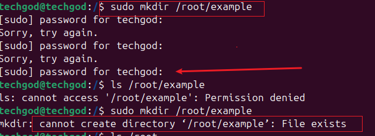
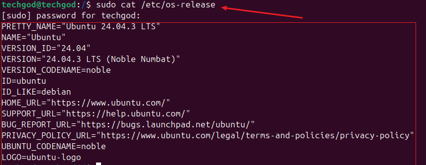

# BASIC LINUX COMMAND

This project seeks to deep dive into linux commands.
Linux command would basically consist the following

- CommandName, 
- Option (s)
- parameter (s)

1. The commandNames represents the the actual command
2. Option or flag, modifies the behaivour of the command

3. The parameter or arguement provides specific information required for the command to execute the desired action.

## MANIPULATING FILES AND DIRECTORIES
Linux as an operating system is basically a combination of files and folders, hence the ability to manipulate files and folders becomes imperative. The following commands are used to navigate the file system in  linux.

## 1. sudo command

---
The Sudo command is used to carry out actions that require special permission like creating files in certain areas or changing important system settings. The Sudo stands for `Superuser do`. The Sudo command is also used for ensuring (a) `Security` (b)`Tracking`.

### Creating a folder with sudo
---
To demostrate the use of Sudo in creating a folder in certain privileged location, we run the command shown below, first without sudo and getting `permission-denied` and with sudo to `successfully`. To verify the creating of the file, use the sudo command to do an `ls` (listing) command on terminal to view the file `example`  

## 2.pwd command
The pwd command stands for `present working directory`. As the name depicts, it shows the path of your current working directory. Refer to the picture that show the command showing we are currently working from the root directory. . At the top of the linux file system is the root directory, denoted by a single slash. All other folder used in the linux file system seat in the root. refer to below screen shot.. To list the file system and also extend the view using the -l flag, we run the command as seen in the screen shot below . To navigate into any of the above listed folders, we navigate via the root folder signified by the forward slash /. 

Side Hustle Task 1.
This task tends to describe the concept of files and paths in a file.

Create a directory called photo inside /usr, navigate to photos directory. create 3 random photos directory and show the newly created directories on the terminal. Navigate into them and show the full path on the screen. . The following shows options that can be ran with the `ls` command. , , 

## 3.cat command.
The cat command list and writes file content to the standard output.
Below is an example of the os-release printed on the screen 

## 4.cp command
This command is used to copy file from one directory to the other.
To copy multiple files into a directory,enter the names of the files followed by the destination
The following shows the various cp commands with flags and what function they carry out.
, , 

## 5.mv command
This command is used to move and rename files and directories.To move the file, we run the command as seen below
 and to rename a file we use below 

## 6.rm command
This is used to delete files within a directory. To do this , we run the command
 and to remove multuple files we use .

## 7.touch command
This command enables us create an empty file. we use command as seen below

## 8.find command

This is used to search for files within a specific directory, as seen below. Checking for a notes.txt file in home directory. 

This marks the end of the project work.