# Introduction to Docker and containers
To understand docker, we need to understand containers. A container is like a shipping container for software: once packed, it can be moved and run anywhere without unpacking or reconfiguring.

Docker is a platform that lets you package, ship, and run applications in lightweight, portable units called containers.

To fully understand and appreciate Docker, we need to understand the solution its provides to software developers. Often times, after development and testing is done at developers machine/laptop/server. The software is shipped or downloaded by users and ran on their machine, some times the software encounters several issue because of system requirements, libraries and update required by the software to run successfully is not on the host environment. While the developers system will have all that is required for the software to run, not all other system will have all the requirements. This issue known by IT professional as ` it works on my machine ` curse is effectively resolved by Docker.  

In order to achieve this, Docker bundles the following together

1. *The application*
2. *Its runtime eg Node js, .NET, Java*
3. *Libraries and dependencies*
4. *Configuration*

into one single consistent unit that runs the same everywhere.

A Docker container has the following advantages:
1. **Portability across different environment**:  Docker containers encapsulate the entire application with its dependencies and configurations, this ensures the application can run on different platform negating the `it works on my machine` curse.

2. **Resource efficiency compared to virtual machines**: Docker containers share the underlying host operating system kernel making them light weight and nimble.

3. **Rapid application deployment and scalling**: Docker containers can be effortlessly spun up or turn down, facilitating the swift deployment of applications. This ensures that with docker, containers ability to scale becomes a wand in your hand, transforming the challenges of deployment into a choreographed ballet of efficiency.

## Comparison of Docker Container with Virtual machines.
Docker and virtual machines are both technologies used for application deployment but differ on the approach to virtualization. While virtual machies emulate the entire operating system, resulting in higher resource overhead and slower performance, Docker utilizes containers to encapsulate the applications and their dependencies  while sharing the host OS kernel. This makes it lightweight and easier to start and ensures portability across different environments.

### Importance of Docker.

**Technology and industry impact** : The significance of Docker in technology stems from the fact that software development and deployment can now been done seamlessly across various platforms 

**Real world impact** : Implementing Docker brings tangible benefits to organisations. It streamlines the development process, promotes colloaboration between development and operations teams, and accelerates the delivery of applications.

*Target Audience* :
1. DevOps professional 
2. Developers

## Getting started with Docker.

Installing Docker:

1. Installing docker: To install docker, we first update the host ubuntu -linux environment by running the command *`sudo apt-get update`*
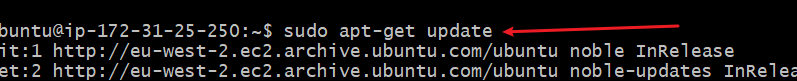 This command refreshes the package nlist on a debian based system, ensuring latest software information is available.

2. Install ca-certificate and essential packages by running the command: *`sudo apt-get install ca-certificates curl gnupg`*
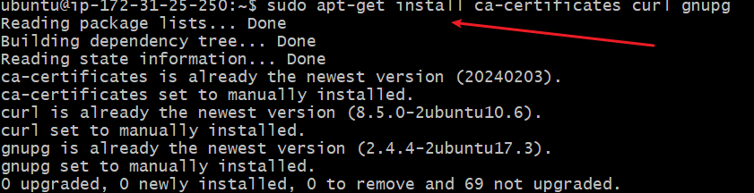

3. To create directory(/etc/apt/keyring) with specific permission 0755 for storing key ring files, we run the command *`sudo install -m 0755 -d /etc/apt/keyrings`*
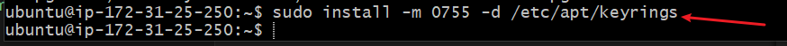

4. download Docker GPG key using 'curl' *`curl -fsSL https://download.docker.com/linux/ubuntu/gpg | sudo gpg --dearmor -o /etc/apt/keyrings/docker.gpg`*
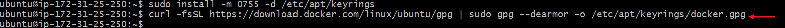

5. *`sudo chmod a+r /etc/apt/keyrings/docker.gpg`* This command sets read permission for all users
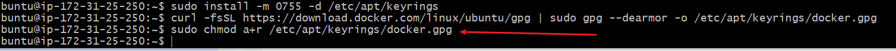

6.  Adding repository to Apt sources.
*`echo \"deb [arch=$(dpkg --print-architecture) signed-by=/etc/apt/keyrings/docker.gpg] https://download.docker.com/linux/ubuntu \
  $(. /etc/os-release && echo "$VERSION_CODENAME") stable" | \
  sudo tee /etc/apt/sources.list.d/docker.list > /dev/null`*
  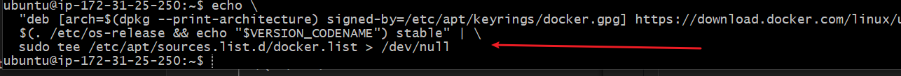

7. Update the installed docker by running the command.*`sudo apt-get update`*
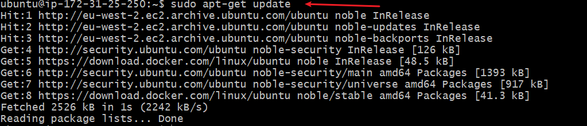

8. Installing the latest verson of docker:
*`sudo apt-get install docker-ce docker-ce-cli containerd.io docker-buildx-plugin docker-compose-plugin`*
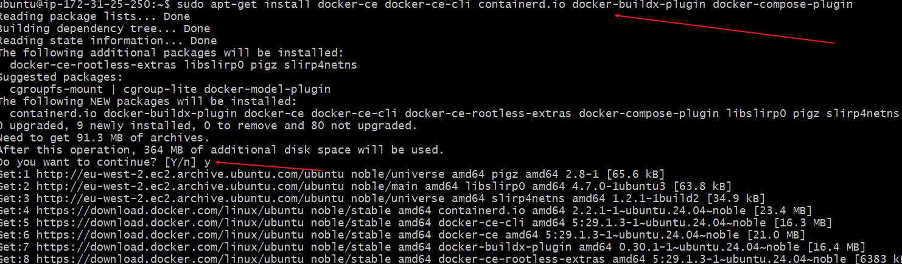

9. To verify that docker has been installed
*`sudo systemctl status docker`*
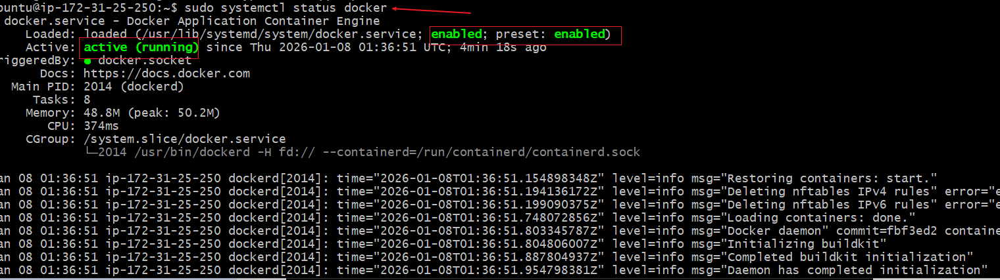

10. Adding the ubuntu user to docker admin, so we don not need to use sudo for command, we run the command *`sudo usermod -aG docker ubuntu`* 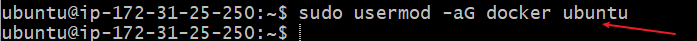

#### Running hello-world container ####
Run the command *`docker run hello-world`*
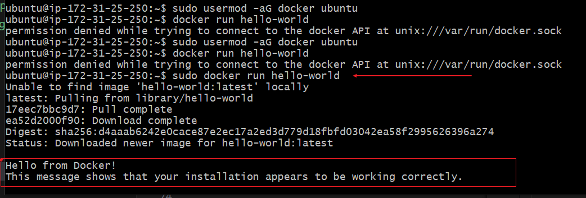

At the execution of this command, docker performs the following process

1. pulls the hello-world images from the repository id not available locally.

2. Creates a container which is an instance of the image with its own isolated file system and runtime environment.

3. It the starts the container and executes whatever command in the image, in this case it print `hello-world`

#### understanding docker image and contaimer life cycle ###

Once a container is created from an image, the image becomes immutable. The container has the following life cycle

> CREATE, START, STOP and DELETE 

11.  Verifying successful execution: we run the command *`docker images`*
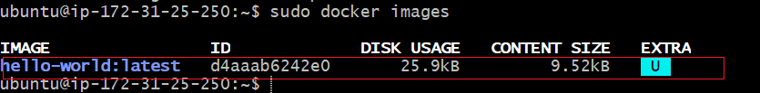

### The following are basic docker command ###
a. Docker run command- This creates and start a container
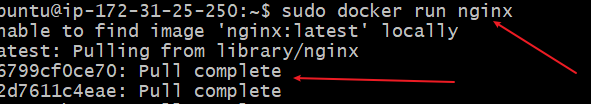

b. Docker ps command: this display the list of running containers
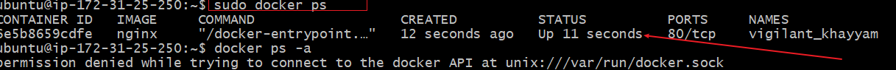

c. Docker ps -a : list all container, including stopped containers
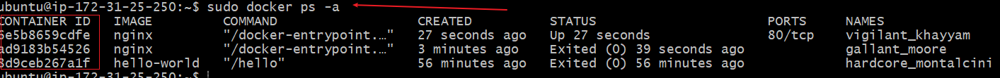

d. Docker stop command halts a running container:  
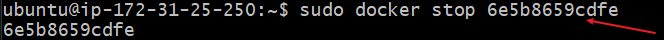

e. Docker Pull: This command downlaod a docker image from registry.
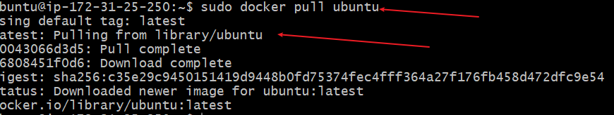

f. Docker Push: This command pushes an image to the registry.
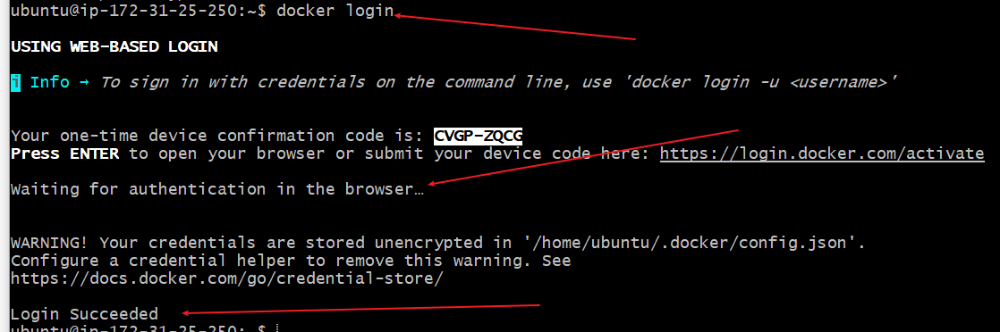 To push an image to the repository, you need to login into docker as seen in the image 18.

g. Docker push: Pushing the image to docker.com.  # Push a local image to Docker Hub
docker push your-username/image-name
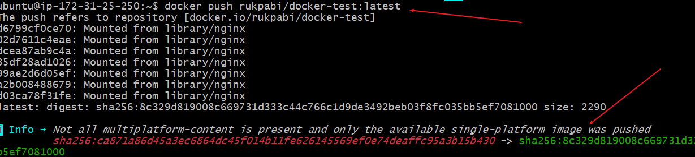

h. Docker images: This list all the images
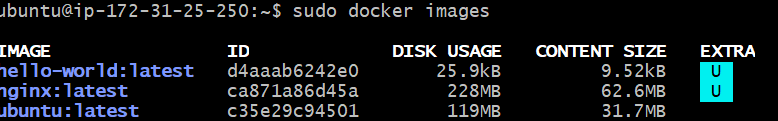

j. Docker rmi command is use to remove an image from the container. 

 

