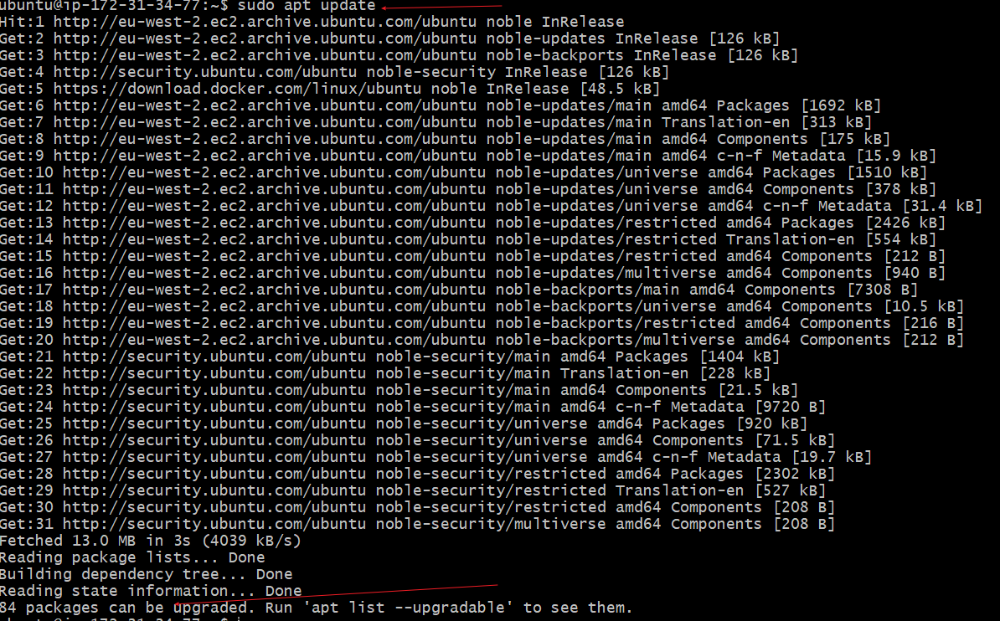
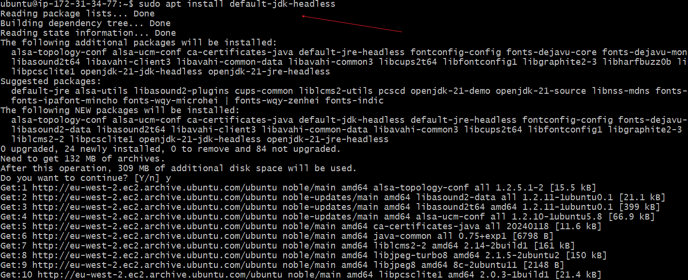
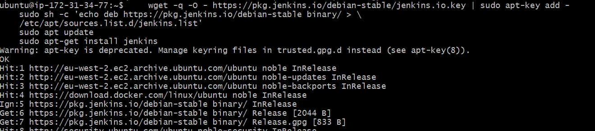
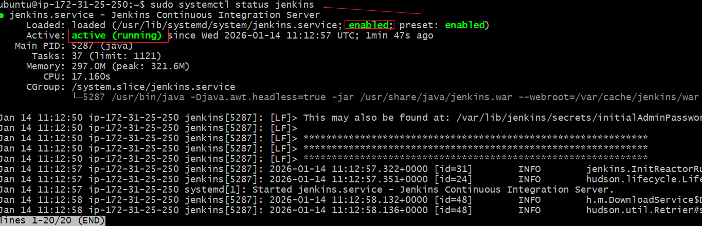
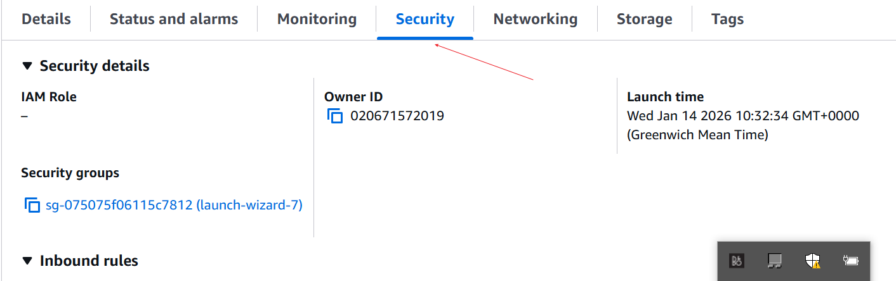
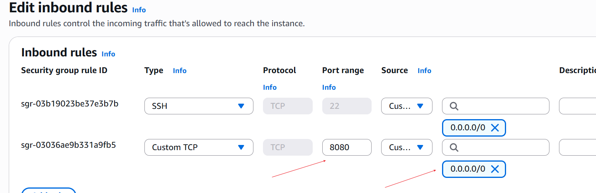
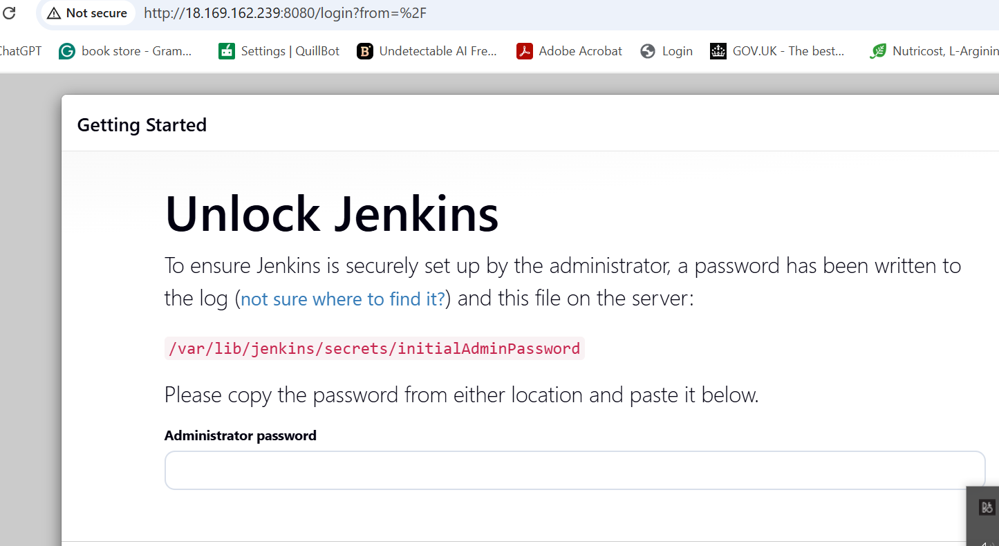
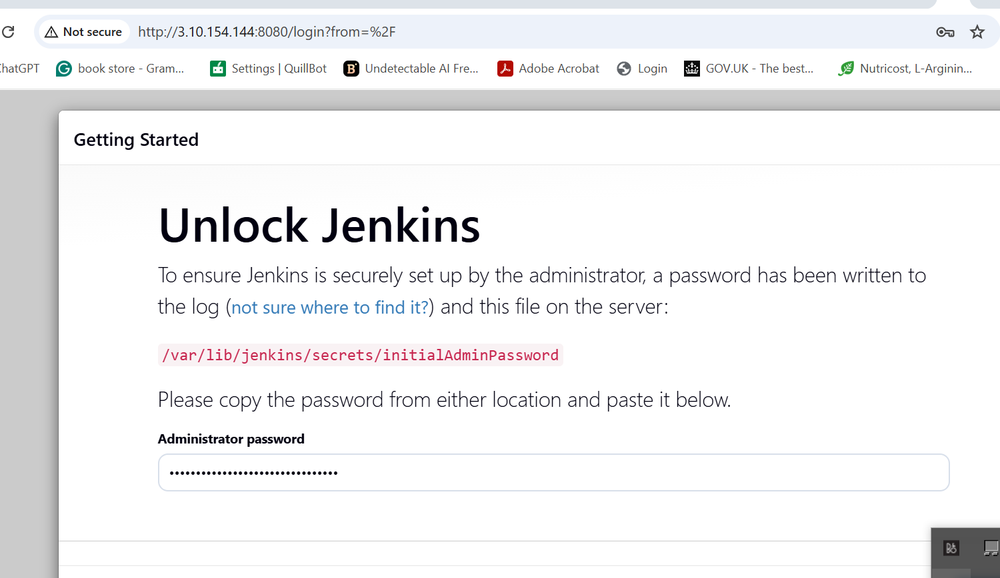
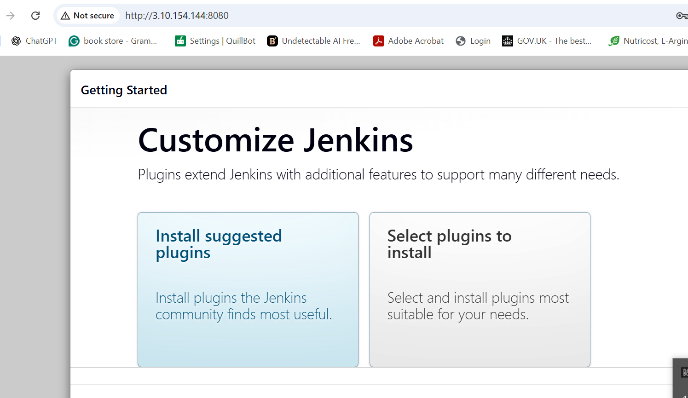
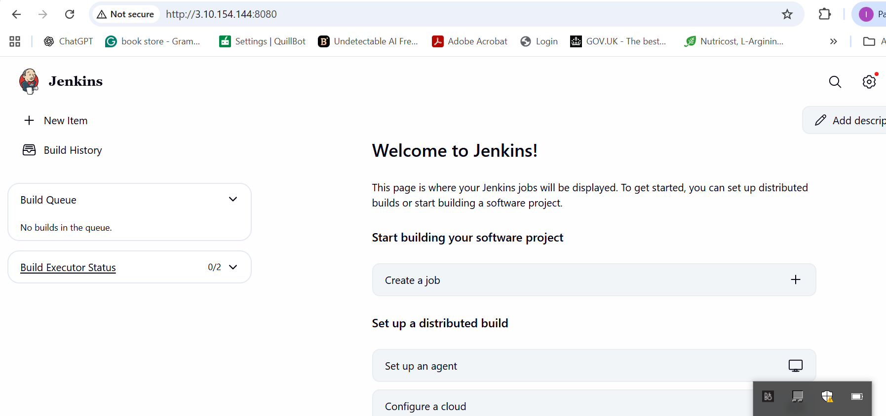

# Introduction to jenkins 

*`Jenkins`* is an open-source automation server used to automate software development tasks, especially building, testing, and deploying code.Jenkins helps you deliver software faster and more reliably
Jenkins automates parts of the CI/CD pipeline:

##### CI (Continuous Integration)

- Automatically builds code when changes are pushed

- Runs tests to catch bugs early

##### CD (Continuous Delivery / Deployment)

- Automatically deploys applications to servers or cloud platforms

- Integrates with Docker, Kubernetes, AWS, 
etc.

## How Jenkins work
### A developer pushes code to a repository (GitHub, GitLab, Bitbucket)

1. Jenkins detects the change (via webhook or polling)

2. Jenkins runs a pipeline:

3. Build the app

4. Run tests

5. Create artifacts (e.g., Docker images)

6. Deploy to an environment

## Key Jenkins concepts

1. Job / Pipeline

A set of automated steps defined using a Jenkinsfile (written in Groovy)

2. Jenkinsfile

A text file that describes the pipeline stages

Stored in the source code repo

3. Plugins

Jenkins has thousands of plugins

Extend functionality (Docker, Git, Slack, AWS, etc.)

4. Agent (Node)

A machine that runs Jenkins jobs Can be physical, virtual, or a Docker container

## Installing Jenkins

To update the package repository, we run the command *`wget -q -O - https://pkg.jenkins.io/debian-stable/jenkins.io.key | sudo apt-key add -
    sudo sh -c 'echo deb https://pkg.jenkins.io/debian-stable binary/ > \
    /etc/apt/sources.list.d/jenkins.list'
    sudo apt update
    sudo apt-get install jenkins`*

Install JDK, using the commamd *`sudo apt install dafauklt-jdk-headless`*lk

Install jenkins
To install jenkins, we run the command

The command install jenkins, importing the jenkins GPG key for package verification, adding the jenkins repository to the system sources, updating package list and finally installing jenkins through the package manager (apt-get)

To confirm if jenkins has been installed , run the command *`sudo systemctl status jenkins`*

In order to view jenkins web portal, we will need to create new inbound rule for port 8080 in the security group of our jenkins /EC2 instance.

### Setting up jenkins on the web console

1. Input the jenkins instance ip-address on your own browser with the jenkins port 8080.
i.e https://public_ip_address:8080

2. On your instance , check the following location for the initial password "var/lib/jenkins/secrets/initialAdminPassword" copy and enter the password and then change to your own password.

3. Follow the prompt and install the suggested plugin

4. Create a user account and login

