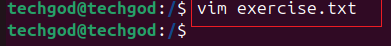
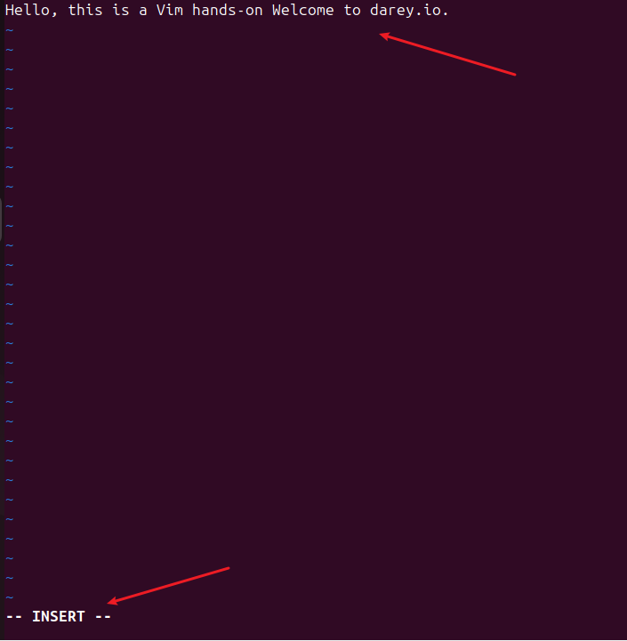
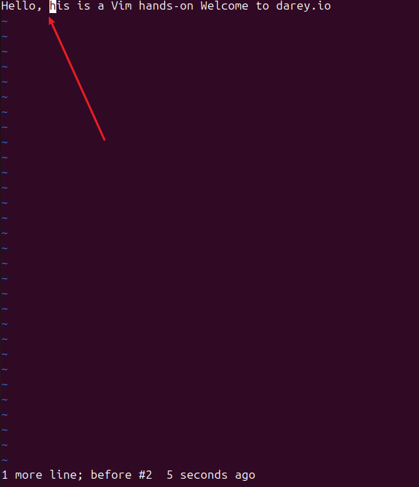
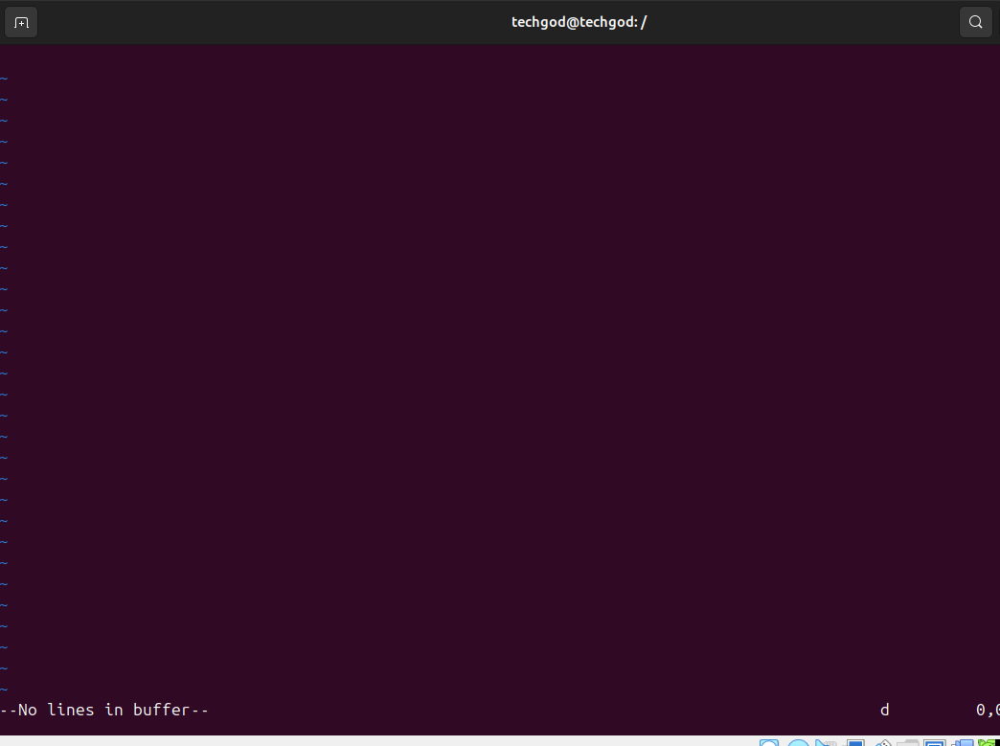
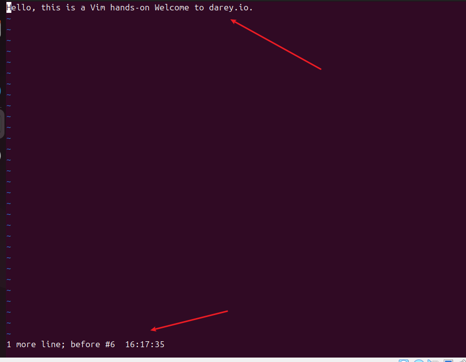
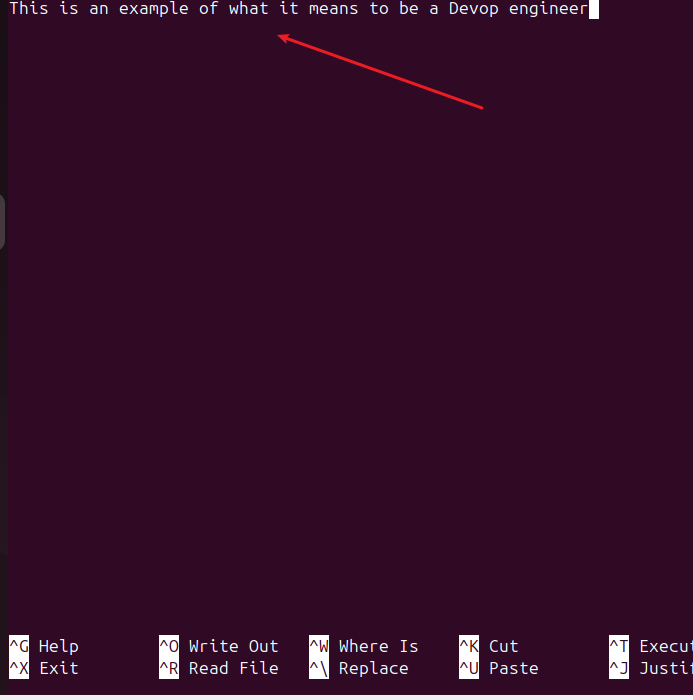
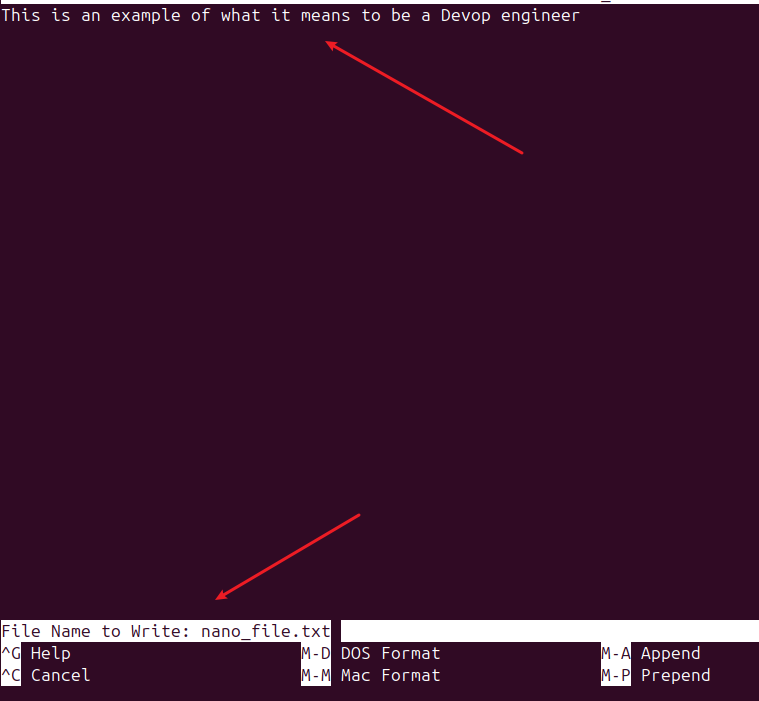

# LINUX TEXT EDITOR
A linux text editor is a software application specifically designed for creating, modifying, and managing text files on a linux-based operating system.

There are several text editor, however we will be taking a look at 

- `VIM Text editors`
- `Nano text editor`

## VIM text editor
vim text editor is a powerful and versatile text editing tool deeply ingrained in the unix and linux ecosystem. In working with vim, we will run the following command 

- creating a file exercise.txt 

- Enter insert mode i : 

- Deleting a character: To delet a character, exit the insert mode, position the cursor on `t` in this and press `x`

- Deleting a line : To delete a line, ensure you are not in the insert mode.place the cursor on a line and press d twice. 

- Undoing changes: Make a change(deleting a line) in this case.press escape to enter normal mode and press u to undo the deleted line. 

- Saving changes: to save changes, exit the insert mode by pressing esc, the type :wq  

- Quitting without saving: To quit the vim command without saving, type the command :q!  

## NANO text editor

Nano text editor is a user friendly test editor and widely used. To start we create a file nano_file.txt

- open a file, to open a file type the command 

- Entering and editing text: type a random text in the editor 

- Saving changes : Save the changes by pressing `ctrl + o` and pressing `Enter`. 

- Open an existing file: to open an existing file type nano existing_file.txt 

This ends the linux editor project.