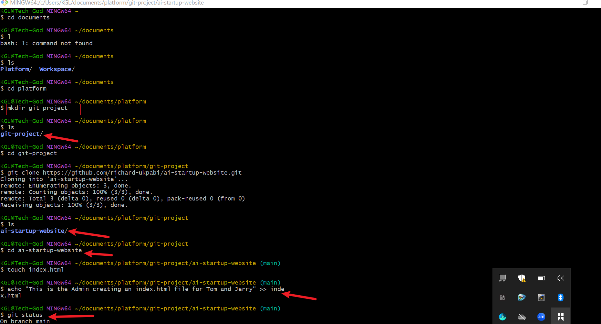
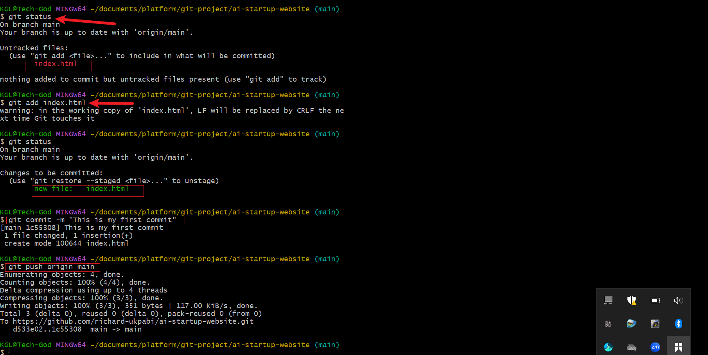
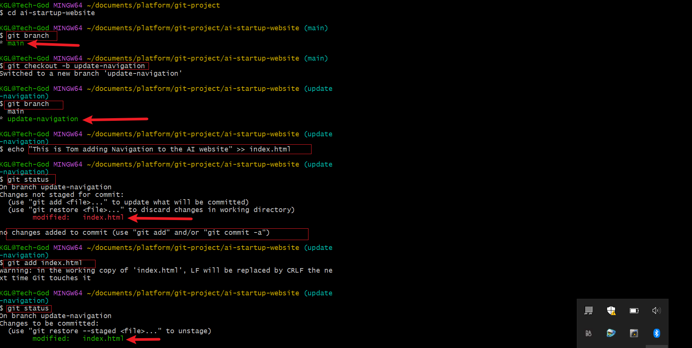
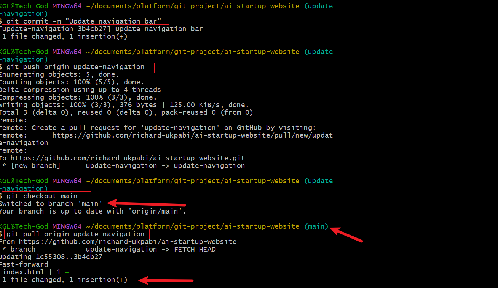
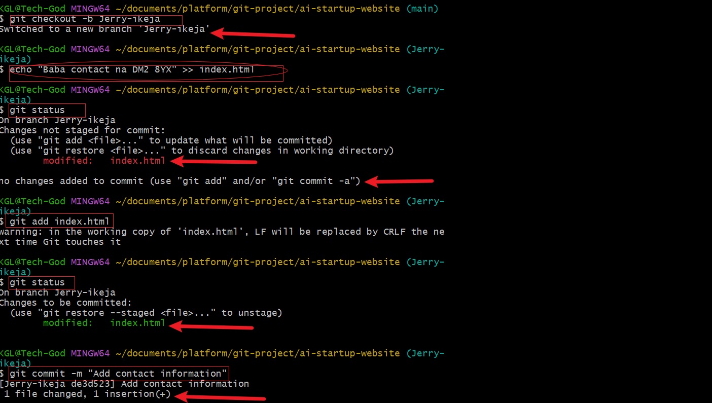
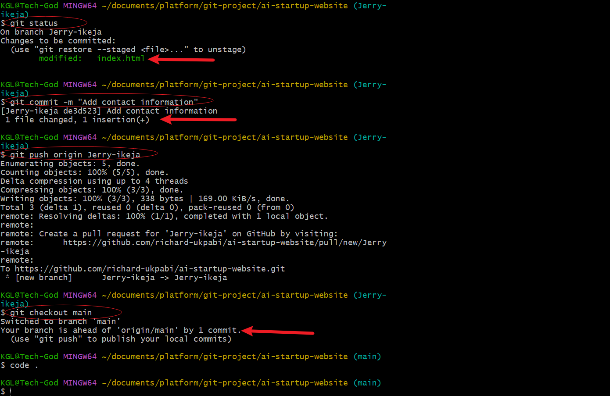

# Basic Git command
## Collaborative website development with Git and GitHub.
Mini Project - Git Version Control Basics
Late Submission

Submit Project

Share Project
Hands-On: Version Control System & Why It Is Needed
A Version Control System (VCS) is a vital tool in software development, designed to track and manage changes to code or documents over time. It enables multiple developers to collaborate on the same project efficiently, by controlling and merging changes made by different team members.

Imagine you're working in a team and your project is about creating a website for a an AI startup company. The website includes various sections like Home, About Us, Services, and Contact Information. Each member of your team is responsible for a different section of the site. Without a Version Control System (VCS), managing this collaboration efficiently would be challenging.

Lets take a view of an example of working without a Version Control System.

Overwriting Work
If a member "Tom" makes changes to the home page file "index.html" to update the navigation and at the same time, another team member "Jerry" makes changes to add contact information to the footer of the same home page thereby editing the same "index.html" file. Without VCS, the last person to upload their version of the file to the shared folder or server would overwrite the other person's changes, resulting in lost work.

How VCS Solves These Problems
Concurrent Development: With a VCS, each team member can work on their sections simultaneously without fear of overwriting each other's work. The VCS tracks all changes and manages different versions of the files, allowing changes to be merged together eventually.

Lets go through an example together to simulate this experience using a VCS tool, "Git"

Introducing Git: A Leading Version Control System
Git is a tool that helps people work together on computer projects, like building a website. Think of it as a shared folder on your computer, but much smarter. It keeps track of all the changes everyone makes, so if something goes wrong, you can always go back to a version that worked. It also lets everyone work on their parts at the same time without getting in each other’s way.

When working on a project, especially with a team, it's easy for things to get mixed up if you're not careful. For example, if two people try to change the same thing at the same time, it could cause problems. Git helps prevent these kinds of mix-ups.

Conceptualising Git Set Up with Tom and Jerry
Initial Setup:
Both Tom and Jerry have Git installed on their computers.
They clone (or download) the project repository from a central repository (like GitHub, GitLab, or Bitbucket) to their local machines. This gives them each a complete copy of the project, including all its files and version history.
Tom and Jerry Start Working:
Tom and Jerry pull the latest changes from the central repository to ensure they start with the most current version of the index.html file.
They both create a new branch from the main project. A branch in Git allows developers to work on a copy of the codebase without affecting the main line of development. Tom names his branch update-navigation, and Jerry names his add-contact-info.
Making Changes:
On his branch, Tom updates the navigation bar in index.html.
Simultaneously, Jerry works on his branch to add contact information to the footer of the same file.
They commit their changes to their respective branches. A commit in Git is like saving your work with a note about what you've done.
Merging Changes:
Once they're done, Tom and Jerry push their branches to the central repository.
Tom decides to merge his changes first. He creates a pull request (PR) for his branch update-navigation. A PR is a way to tell the team that he's done and his code is ready to be reviewed and merged into the main project.
After reviewing Tom's changes, the team merges his PR into the main branch, updating the index.html file on the main project line.
Jerry then updates his branch with the latest changes from the main project to include Tom's updates. This step is crucial to ensure that Jerry is working with and integrating his changes into the most current version of the project.
Jerry resolves any conflicts that arise from Tom's changes and his own. Git provides tools and commands to help identify and resolve these conflicts.
Jerry then pushes his updated branch and creates a PR for his changes. The team reviews Jerry's additions, and once they're approved, his changes are merged into the main project.
Conclusion:
Through this process, Tom and Jerry were able to work on the same file simultaneously, without overwriting each other's work. Git tracked their changes, allowing them to merge their updates seamlessly into the main project. This example illustrates the power of using a VCS like Git for collaborative development, ensuring that all contributions are preserved and integrated efficiently and effectively.

In the next mini project we will get hands on to simulate the entire journey between both Tom and Jerry.

Hands-On Code Reviewing a Pull Request

Previous step
Mini Project - Basic Git Command.

 Below shows the practical implementaion of the above.
This is a hand on git project that teaches and fosters the primary essence and use of git and github in colloboration in software development.

The section is broken into the following:

1
- setup and initial configuration 
- creation of GitHub Repository
- cloning the repository

2

- Simulating Tom'work

3

- Simulating Jerry's work

To aid our understanding, enabling pictures will be used to guide the work done.

 Cloning the repository
-----------------
Setup and initial configuration + creation of github repository were done intially, our pictorial depiction of worksone will start from cloning the repository as see below

The first arrows shows the creation of git-project in the work directory called platform and subsequent cloning of the repository into the directory before navigating to the cloned repository on the local machine. The fourth arrow shows the creation and updating the index.html file with the required content.

The first arrow in the above picture (git status) confirms the status of file and content. the second arrow shows when the file is added, commited with the caption' this is my first commit' and eventual push.

Simulating Tom's work
--------------------
In simulating Tom's work, a branch was created for Tom (update-navigation) and switched to using the command (`git checkout-b`) to warehouse Tom's work/input

Thereafter Tom updates the index.html file before adding the file and content to staging. the changes made to the file are seen commited with the message `update navigation bar` before been pushed. Thereafter a checkout is done back to main before pulling the work done by Tom.

SIimulating Jerry's work
-------------------------
In simulating Jerry's work, a branch was created for Jerry (Jerry-ikeja) and switched to using the command (`git checkout-b`) to warehouse Jerry's work/input

Thereafter Jerry updates the index.html file before adding the file and content to staging. the changes made to the file are seen commited with the message `add contact info` before been pushed. Thereafter a checkout is done back to main.