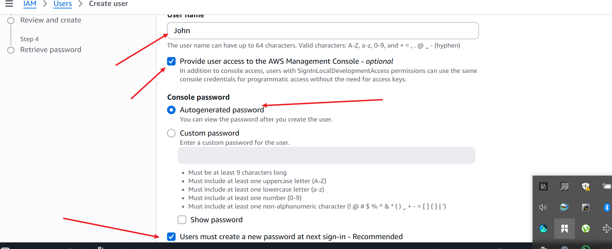
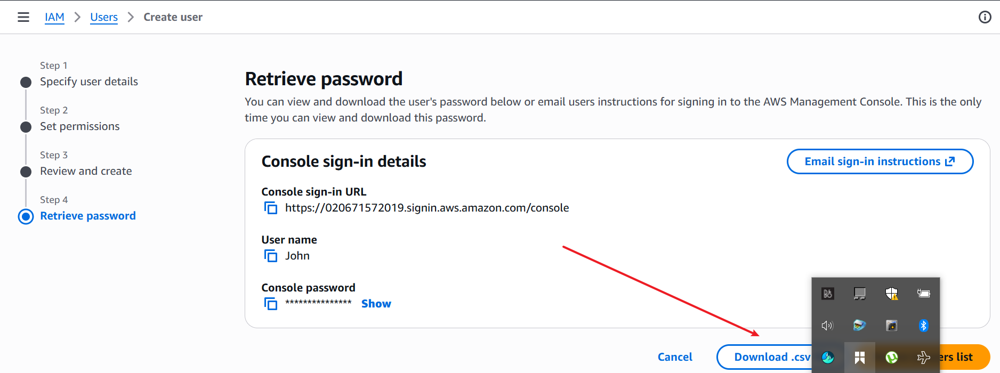

Introduction to Cloud Computing – Security & Identity Management (IAM)
Project Duration: 2 hours

This mini project is designed to guide you through the intricacies of Amazon Web Services (AWS), specifically focusing on Identity and Access Management (IAM). Before diving into the specifics of IAM, it’s crucial to establish that a basic understanding of cloud computing principles is a prerequisite for this project. If you’re hearing about "Cloud" for the first time, it would mean that you have not followed the program so far, so it is highly recommended that you go back to the start of this program to learn about the cloud.

As a recap, it involves delivering computing services over the internet, including servers, storage, databases, networking, software, analytics, and intelligence, to offer faster innovation, flexible resources, and economies of scale.

In this project, we will be working with a hypothetical fintech startup named Zappy e-Bank. This fictitious company represents a typical startup venturing into the financial technology sector, aiming to leverage the cloud's power to innovate, scale, and deliver financial services. The scenario is set up to provide a realistic backdrop that will help you understand the application of AWS IAM in managing cloud resources securely and efficiently.

The Importance of IAM for Zappy e-Bank
For Zappy e-Bank, like any company dealing with financial services, security and compliance are paramount. The company must ensure that its data, including sensitive customer information, is securely managed and that access to resources is tightly controlled. AWS IAM plays a critical role in achieving these security objectives by allowing the company to define who is authenticated (signed in) and authorized (has permissions) to use resources.

IAM will enable Zappy e-Bank to:
Create and manage AWS users and groups, to control access to AWS services and resources securely.
Use IAM roles and policies to set more granular permissions for AWS services and external users or services that need to access Zappy e-Bank' AWS resources.
Implement strong access controls, including multi-factor authentication (MFA), to enhance security.
This project will walk you through setting up IAM for Zappy e-Bank, creating a secure environment that reflects real-world usage and challenges. Through this hands-on experience, you will learn the fundamentals of IAM, how to manage access to AWS resources, and best practices for securing your cloud environment.

Project Goals and Learning Outcomes
By the end of this project, you will have:

Gained a solid understanding of AWS IAM, including users, groups, roles, and policies.
Learned how to apply IAM concepts to secure a fintech startup’s cloud infrastructure.
Developed practical skills in using the AWS Management Console to manage IAM.
Understood the significance of secure access management and its impact on compliance and data security in the fintech industry.
Project Setup
Log in to the AWS Management Console: Use your administrator account to log in.

Navigate to the IAM Dashboard: Here, you'll manage users, groups, roles, and policies.

Excercises:
Creating IAM Users
An IAM user is a unique identity within an AWS account that represents a person or service, granting specific permissions to access and interact with AWS resources under controlled and customizable security policies.

Imagine that you have a big, secure building (AWS account) that you own and control. When you first get the keys to this building, you're given a master key (root user) that can open every door, access every floor, and make changes to the building's structure itself.

This master key is powerful, allowing you to do anything from adding new rooms (services) to changing the locks (security settings). However, because this key can do so much, it's also very risky to use it for daily tasks—like if you lost it, someone could do anything they want with your building.

Now, imagine you have specific tasks that need to be done in the building, like cleaning, maintenance, or security checks. You wouldn't give out your master key to every person who needs to do those jobs. Instead, you create specific keys (IAM users) that can only open certain doors or access certain floors. These keys are less powerful but much safer to use for everyday tasks. They ensure that the people holding them can only access the parts of the building they need to do their jobs and nothing more.

Let's set up IAM users for a backend developer, John, and a data analyst, Mary, by first determining their specific access needs.

As a backend developer, John requires access to servers (EC2) to run his code, necessitating an IAM user with policies granting EC2 access.

As a data analyst, Mary needs access to data storage (AWS S3 service), so her IAM user should have policies enabling S3 access.

Considering Zappy e-Bank's plan to expand its team with 10 more developers and 5 additional data analysts in the coming months, it's inefficient to individually create similar policies for each new member. A more streamlined approach involves:

Crafting a single policy tailored to each role's access requirements.
Associating this policy with a group specifically designed for that role.
Adding all engineers or analysts to their respective groups, simplifying the management of permissions and ensuring consistent access across the team.
Create policy for the Development team
In the IAM console, click on policies

Alt text

Click on create policy

Alt text

In the select a service section, search for ec2

Alt text

For simplicity sake, select the "All EC2 actions" checkbox

Alt text

Also, make sure to select "All" in the Resources section

Alt text

Click Next

Provide the name developers and description for the policy.Alt text

Click on Create Policy

Notice that after creating the policy, if you search for "developer" in the search box, you will notice that a number of policies are returned. This highlights the presence of both AWS managed and customer managed policies. AWS managed policies are predefined by AWS and provide permissions for many common use cases, allowing for quick and broad access management across AWS services without the need for custom policy creation like we just did. In contrast, customer managed policies are created and fully controlled by you, allowing for more tailored, specific access controls that can be finely tuned to your organization's requirements.

Alt text

Create policy for the Data Analyst team
Repeat the process above for the Data Analysts team, but instead of EC2, search for S3. Also name the policy analyst instead of developers. You can give it any description of your choice.

Create Group for the Development team
In the IAM console navigation, select User group and in the top right click Create group
Alt text

Provide an a name for the group
Alt text

Attach the developer policy we created earlier to the group. This will allow any user in the Development-Team group to have access to EC2 instances alone
Alt text

You have successfully created a group and attached a permission policy for any user added to the group to have access to the EC2 instance only. Recall that users in this group will be backend developers only.
Alt text

Create Group for the Data Analysts team
Repeat the process above for the Data Analysts team.

i. The Group name should be Analyst-Team

ii. Instead of attaching developers policy, attach analyst policy.

Recall that you only allowed S3 access for this policy. So any user in this group will have access to S3 Service. In our case, our users will be the data analysts.

Creating IAM User for John

Let's recall that John is a backend developer, therefore he need to be added as a user to the Development-Team group

Navigate to the IAM dashboard, select "Users" and then click "Create user".

Alt text

Review the highlights in the screenshot

Provide the name of the user. In this case "John"
Ensure that the user can access the AWS Management Console. If this is not selected, the user will not be able to login from the web browser.Alt text
Permissions: Add the John to the development team group.Alt text

Click on Create user

Alt text

Download the login credentials for John
Alt text

Creating IAM User for Mary

Repeat the same step for Mary. But recall that Mary is a Data analyst, which means she need to be added as a user to the Analyst-Team group

Testing and Validation
Testing John's Access

Login as John: Use the credentials provided to John to log into the AWS Management Console. This simulates John's user experience and ensures he has the correct access.

Access EC2 Dashboard: Navigate to the EC2 dashboard within the AWS Management Console. John should be able to view, launch, and manage EC2 instances as his role requires access to servers for deploying and managing backend applications.

Perform EC2 Actions: Attempt to create a new EC2 instance or modify an existing one to confirm that John has the necessary permissions. If John can successfully perform these actions, it indicates his IAM user has been correctly set up with the appropriate policies for a backend developer.

Testing Mary's Access

Login as Mary: Use the credentials provided to Mary to log into the AWS Management Console. This ensures that Mary's user experience is as expected and that she has the correct access.

Access S3 Dashboard: Navigate to the S3 dashboard within the AWS Management Console. Mary should be able to view, create, and manage S3 buckets as her role requires access to data storage for analyzing and managing data.

Perform S3 Actions: Try to create a new S3 bucket or upload data to an existing bucket to verify that Mary has the necessary permissions. Successful execution of these tasks will confirm that Mary's IAM user has been properly set up with the appropriate policies for a data analyst.

Validating Group Policies

For both users, ensure that their access is confined to their role-specific resources (EC2 for John and S3 for Mary) and that they cannot access other AWS services beyond what their group policies permit. This validation ensures adherence to the principle of least privilege, enhancing security by limiting access to only what is necessary for each user's role.

Implement Multi-Factor Authentication (MFA)
Now that you have created a new users. Let's create Multi-Factor Authentication for John. But before we to that, what is MFA ?

Multi-Factor Authentication (MFA) is a security feature that adds an extra layer of protection to your AWS account and resources. With MFA enabled, users are required to provide two or more forms of authentication before they can access AWS resources.

John, the backend developer, logs into the AWS Management Console to access EC2 instances for deploying and testing his code. However, to further secure his access, Zappy e-Bank requires John to use MFA in addition to his regular username and password.

When John attempts to log in, after providing his username and password, AWS prompts him to enter a one-time code generated by an MFA device.

Setting Up MFA for John
CLick on User and then click on john. It is assumed we already created a user account for johnAlt text

Click on enable MFA as shown in the image belowAlt text

Enter a device name for john MFA and select authenticator appAlt text

Note: You should install authenticator app like Google authenticator or microsoft authenticator on your mobile device if you don't have it installed.

Click on Next

Open your Google authenticator or microsoft authenticator application on your mobile device to scan the QR Code, then you can fill in the 2 consecutive codes as shown in the image belowAlt text

By completing step 1-5, MFA will be enabled for johnAlt text

Setting Up MFA for Mary
Repeat the same step for Mary

Project reflection
Explain the Role of IAM in AWS: Describe the purpose of Identity and Access Management (IAM) in Amazon Web Services and how it contributes to the security and efficient management of cloud resources.

Differentiate Between IAM Users and Groups: Discuss the differences between IAM users and IAM groups within the context of AWS. Provide examples of when you would create an IAM user versus when you would organize users into groups.

Describe the Process of Creating IAM Policies: Explain the steps involved in creating a custom IAM policy for a specific role within an organization. Include details on selecting permissions and attaching the policy to users or groups.

Explain the Significance of the Principle of Least Privilege: Describe what the principle of least privilege means in the context of IAM and AWS, and why it is important for maintaining security in cloud environments.

Reflect on the Scenario with John and Mary: Based on the hands-on project setup for John (backend developer) and Mary (data analyst), outline the specific IAM configurations (users, groups, policies) created for each role. Discuss how these configurations align with their job functions and the principle of least privilege.

Excercises:
Creating IAM Users:Login with root user account, and search for IAM console. On the console click `policy`

2. click create policy

. Ensure to select all `ACTION` and all `RESOURCES`

3. click next and enter name policy and also add describtion

5. created policy, when you search for developer in policy.

## Create policy for the Data Analyst team
Repeat the process above for the Data Analysts team, but instead of EC2, search for S3. Also name the policy analyst instead of developers. You can give it any description of your choice

 and

Create policy with the created s3 resource called analyst.

## Create Group for the Development team

1. In the IAM console navigation, select User group and in the top right click Create group

2. Provide an a name for the group

3. Attach the developer policy we created earlier to the group. This will allow any user in the Development-Team group to have access to EC2 instances alone

4. You have successfully created a group and attached a permission policy for any user added to the group to have access to the EC2 instance only. Recall that users in this group will be backend developers only.

### Create Group for the Data Analysts team

Repeat the process above for the Data Analysts team.

i. The Group name should be Analyst-Team

ii. Instead of attaching developers policy, attach analyst policy.

Recall that you only allowed S3 access for this policy. So any user in this group will have access to S3 Service. In our case, our users will be the data analysts.

 and 
adding the analyst group

## Creating IAM User for John

Let's recall that John is a backend developer, therefore he need to be added as a user to the Development-Team group

Navigate to the IAM dashboard, select "Users" and then click "Create user".

2. Review the highlights in the screenshot

Provide the name of the user. In this case "John"
Ensure that the user can access the AWS Management Console. If this is not selected, the user will not be able to login from the web browser.

Permissions: Add the John to the development team group.

3. click on create user

4. Download credentials

Creating IAM User for Mary

Repeat the same step for Mary. But recall that Mary is a Data analyst, which means she need to be added as a user to the Analyst-Team group

1. Creating the user Mary

2. Adding May to analyst team

3. Click create user Mary.

4. Download user Mary credentials

## Testing and Validation
### Testing John's Access

Login as John: Use the credentials provided to John to log into the AWS Management Console. This simulates John's user experience and ensures he has the correct access

1. 

You will be required to change password as specified during the user creation.

2. login, access and create an EC2 instance

3. Try accessing a srvice not provisioned or not permitted

### Testing Mary's Access
1. Login as Mary

2. Mary Password change 

3. Mary creating a bucket

## Retrogressive testing:
### Validating Group Policies

For both users, ensure that their access is confined to their role-specific resources (EC2 for John and S3 for Mary) and that they cannot access other AWS services beyond what their group policies permit. This validation ensures adherence to the principle of least privilege, enhancing security by limiting access to only what is necessary for each user's role.

Testing if Mary can launch an EC2 instance.while on Mary's profile, search for EC2 and try creating an EC2 instance. permissined should be denied as mary belongs to a group that only has access to S3 bucket.

## MFA device.

### Setting Up MFA for John

1. CLick on User and then click on john. It is assumed we already created a user account for john

2. Click on user john and click enable MFA

3. Enter a device name for john MFA and select authenticator app

select authentiocator app and click next

4. Note: You should install authenticator app like Google authenticator or microsoft authenticator on your mobile device if you don't have it installed.

- Already downloaded and installed

Open your Google authenticator or microsoft authenticator application on your mobile device to scan the QR Code, then you can fill in the 2 consecutive codes as shown in the image below

5. Adding codes from the authenticator app to the MFA

6. By completing step 1-5, MFA will be enabled for john

Setting Up MFA for Mary
Repeat the same step for Mary

1. CLick on User and then click on john. It is assumed we already created a user account for john

2. Enter a device name for john MFA and select authenticator app

select authentiocator app and click next

4. Note: You should install authenticator app like Google authenticator or microsoft authenticator on your mobile device if you don't have it installed.

Adding codes from the authenticator app to the MFA

6. By completing step 1-5, MFA will be enabled for john

Project reflection:
1. Explain the Role of IAM in AWS: Describe the purpose of Identity and Access Management (IAM) in Amazon Web Services and how it contributes to the security and efficient management of cloud resources.
Explanation:
IAM is AWS’s security service that manages authentication (who you are) and authorization (what you’re allowed to do). It ensures that only approved users, applications, and AWS services can access your cloud resources. 

IAM lets you centrally manage:

Users (individual identities)

Groups (collections of users)

Roles (temporary-access identities for apps, EC2, Lambda, etc.)

Policies (JSON documents defining permissions)

2. Differentiate Between IAM Users and Groups: Discuss the differences between IAM users and IAM groups within the context of AWS. Provide examples of when you would create an IAM user versus when you would organize users into groups.
Explanation:
- IAM User = An individual identity with its own credentials.

- IAM Group = A collection of users that all share the same permissions.

IAM groups is used when:

You have multiple users who need the same permissions

You want to avoid managing permissions user‑by‑user

You want consistent access control across teams

and 
Create an IAM user when:

A new employee joins your team

A developer needs their own login

A CI/CD tool or automation script needs programmatic access

You want to track activity per person or per application

3. Identify the Access Requirements
1. Start by determining what the user, group, or role needs to do.
Examples:

Read‑only access to S3

Full access to a specific DynamoDB table

Ability to start/stop EC2 instances

This step ensures you follow the principle of least privilege.
2. Open the IAM Console and Create a New Policy
In AWS IAM:

Go to Policies

Click Create Policy

You can choose:

Visual Editor (easier, guided)

JSON (for advanced or custom rules)

3. Select Services and Permissions
Using the Visual Editor:

Choose the AWS service (e.g., S3, EC2, DynamoDB)

Select the actions allowed (e.g., GetObject, ListBucket, StartInstances)

Specify resources (e.g., a specific bucket or instance ARN)

Add conditions if needed (e.g., IP restrictions, MFA required)

This defines exactly what the policy allows or denies.

4. Review and Create the Policy
Give the policy:

A name

A description

Review the JSON to ensure it matches your intent

Then click Create Policy.

5. Attach the Policy to a User, Group, or Role
Depending on your organization’s structure:

Attach to a User
Use when:

One person needs unique permissions

A service account requires specific access

Attach to a Group
Use when:

Multiple users need the same permissions

You want scalable, consistent access control

Attach to a Role
Use when:

EC2, Lambda, or ECS tasks need temporary permissions

Cross‑account access is required

You want to avoid long‑term credentials

In IAM:

Go to Users, Groups, or Roles

Select the identity

Click Add Permissions

Attach your custom policy

4. Explain the Significance of the Principle of Least Privilege: Describe what the principle of least privilege means in the context of IAM and AWS, and why it is important for maintaining security in cloud environments

Explanation:
In AWS IAM, the principle of least privilege means:

Give every user, group, role, or service only the minimum permissions required to perform their tasks — nothing more.

This ensures identities cannot access resources or perform actions they don’t explicitly need.
It is important because of the following reasons :

Reduces the Attack Surface
If an account is compromised, limited permissions mean the attacker can do far less damage.

2. Prevents Accidental Misuse
Users can’t accidentally delete, modify, or access resources they shouldn’t.

3. Supports Compliance and Auditing
Least privilege aligns with security frameworks like ISO 27001, SOC 2, and NIST.

4. Limits Lateral Movement
If a threat actor gains access to one identity, they can’t easily move to other services or escalate privileges.

5. Encourages Good IAM Hygiene
It forces teams to think intentionally about permissions instead of using broad policies like AdministratorAccess or *:*.

Reflect on the Scenario with John and Mary: Based on the hands-on project setup for John (backend developer) and Mary (data analyst), outline the specific IAM configurations (users, groups, policies) created for each role. Discuss how these configurations align with their job functions and the principle of least privilege
Explanation: 
For John, because he is a developer who works on codes, and the company intends to hire more developers, a policy was created to enable him have access to EC2 instance, called developer and he was added to a group called developer-Team, so that the other developers can also be added to the same team. Same thing applied to Mary, who was added to the analyst-team and attached a policy called analyst which basically is provisoned with access to administer S3 bucket, because as a dataanalyst she requires just the bucket to store data in line with her job function. In both cases, they were given specify policies via the groups their users were attached in line with the principle of lease privilege.

End of project work.