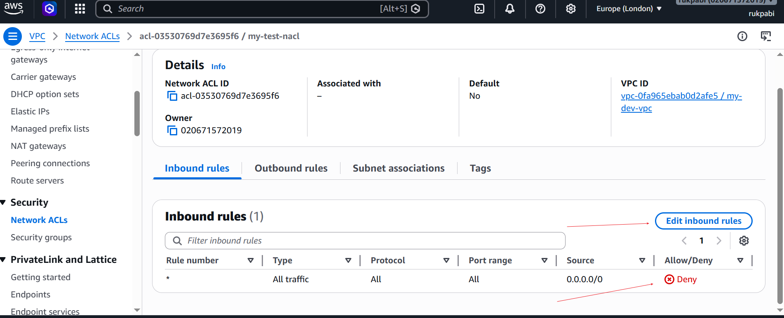
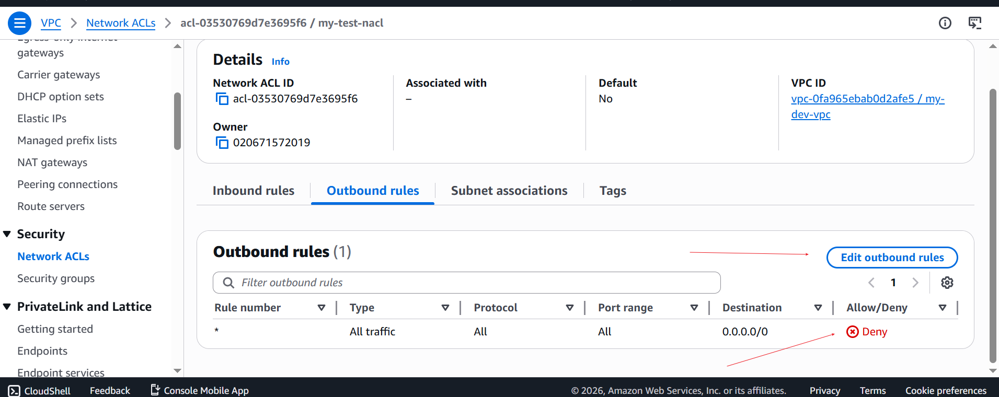

### Security Group & NACL Overview

During this project, we'll explore the core concepts of Amazon Web Services (AWS), specifically focusing on Security Groups and Network Access Control Lists (NACLs). Our objective is to understand these fundamental components of AWS infrastructure, including how Security Groups control inbound and outbound traffic to EC2 instances, and how NACLs act as subnet-level firewalls, regulating traffic entering and exiting subnets. Through practical demonstrations and interactive exercises, we'll navigate the AWS management console to deploy and manage these critical components effectively.

Before we proceed with setting up Security Groups and NACLs, it's essential to ensure a solid understanding of cloud networking basics. If terms like "Security Groups" and "NACLs" are unfamiliar to you, I recommend reviewing earlier materials to establish a strong foundation in cloud computing concepts.

#### Project Goals:

- Understand the concepts of Security Groups and Network Access Control Lists (NACLs) in AWS.
- Explore how Security Groups and NACLs function as virtual firewalls to control inbound and outbound traffic.
- Gain hands-on experience with configuring Security Groups and NACLs to

#### Learning Outcome:

- Gain proficiency in configuring Security Groups and NACLs to control network traffic within AWS environments.
- Understand the differences between Security Groups and NACLs, including their scope, statefulness, and rule configurations.
- Learn how to troubleshoot network connectivity issues by analyzing Security Group and NACL configurations.
- Develop a deeper understanding of AWS networking concepts and best practices for securing cloud environments.

*# Let’s first understand some terms-#*

Security Group (SG):

1. Inbound Rules: Rules that control the incoming traffic to an AWS resource, such as an EC2 instance or an RDS database.

2. Outbound Rules: Rules that control the outgoing traffic from an AWS resource.

3. Stateful: Security groups automatically allow return traffic initiated by the instances to which they are attached.

4. Port: A communication endpoint that processes incoming and outgoing network traffic. Security groups use ports to specify the types of traffic allowed.

5. Protocol: The set of rules that governs the communication between different endpoints in a network. Common protocols include TCP, UDP, and ICMP.

6. Network Access Control List (NACL):
Subnet-level Firewall: NACLs act as a firewall at the subnet level, controlling traffic entering and exiting the subnet.

7. Stateless: Unlike security groups, NACLs are stateless, meaning they do not automatically allow return traffic. You must explicitly configure rules for both inbound and outbound traffic.

8. Allow/Deny: NACL rules can either allow or deny traffic based on the specified criteria.

9. Ingress: Refers to inbound traffic, i.e., traffic entering the subnet.

10. Egress: Refers to outbound traffic, i.e., traffic exiting the subnet.

11. CIDR Block: Specifies a range of IP addresses in CIDR notation (e.g., 10.0.0.0/24) that the NACL rule applies to.

### Default Settings:

Default Security Group: Every VPC comes with a default security group that allows all outbound traffic and denies all inbound traffic by default.

Default NACL: Every subnet within a VPC is associated with a default NACL that allows all inbound and outbound traffic by default.

### What is Security Group?
Imagine you're hosting a big party at your house. You want to make sure only the people you invite can come in, and you also want to control what they can do once they're inside.

AWS security groups are like bouncers at the door of your party. They decide who gets to come in (inbound traffic) and who gets kicked out (outbound traffic). Each security group is like a set of rules that tells the bouncers what's allowed and what's not.

For example, you can create a security group for your web server that only allows traffic on port 80 (the standard port for web traffic) from the internet. This means only web traffic can get through, keeping your server safe from other kinds of attacks.

Similarly, you can have another security group for your database server that only allows traffic from your web server. This way, your database is protected, and only your web server can access it, like a VIP area at your party.

In simple terms, security groups act as barriers that control who can access your AWS resources and what they can do once they're in. They're like digital bouncers that keep your party (or your cloud) safe and secure.

### What is NACL?
NACL stands for Network Access Control List. Think of it like a security checkpoint for your entire neighborhood in the AWS cloud. Imagine your AWS resources are houses in a neighborhood, and you want to control who can come in and out. That's where NACLs come in handy.

NACLs are like neighborhood security guards. They sit at the entrance and check every person (or packet of data) that wants to enter or leave the neighborhood.

But here's the thing: NACLs work at the subnet level, not the individual resource level like security groups. So instead of controlling access for each house (or AWS resource), they control access for the entire neighborhood (or subnet).

You can set rules in your NACL to allow or deny traffic based on things like IP addresses, protocols, and ports. For example, you can allow web traffic (HTTP) but block traffic on other ports like FTP or SSH.

Unlike security groups, which are stateful (meaning they remember previous interactions), NACLs are stateless. This means you have to explicitly allow inbound and outbound traffic separately, unlike security groups where allowing inbound traffic automatically allows outbound traffic related to that session.

In simple terms, NACLs act as gatekeepers for your AWS subnets, controlling who can come in and out based on a set of rules you define. They're like the security guards that keep your neighborhood (or your AWS network) safe and secure.

Difference between Security Groups and NACL
Security Groups in AWS act like virtual firewalls that control traffic at the instance level. They define rules for inbound and outbound traffic based on protocols, ports, and IP addresses. Essentially, they protect individual instances by filtering traffic, allowing only authorized communication.

On the other hand, Network Access Control Lists (NACLs) function at the subnet level, overseeing traffic entering and leaving subnets. They operate as a barrier for entire subnets, filtering traffic based on IP addresses and protocol numbers. Unlike security groups, NACLs are stateless, meaning they don't remember the state of the connection, and each rule applies to both inbound and outbound traffic independently.

Note- In security groups, there's no explicit "deny" option as seen in NACLs; any rule configured within a security group implies permission, meaning that if a rule is established, it's automatically allowed.

Let’s come to the practical part,

This practical will be in Two parts-

1. Security group

2. NACL

#### Security group
Initially We’ll examine the configuration of inbound and outbound rules for security groups.
Create a security group allowing HTTP for all traffic and attach it to the instance.
explore various scenarios:
Implement inbound traffic rules for HTTP and SSH protocols and allow outbound traffic for all.
Configure inbound rules for HTTP with no outbound rules.
Remove both inbound and outbound rules.
Have no inbound rules but configure outbound rules for all traffic.
NACL
Examine the default settings for both inbound and outbound rules in NACL configuration.
Modify the inbound rules to permit traffic from any IPv4 CIDR on all ports.
Adjust the outbound rules to allow traffic to all CIDRs.

### Part - 1
Just a quick reminder about the subnets we configured in our VPC in the [Previous project](./AWS VPC mini project.md) . In the public subnet, we've created an EC2 instance that is running, hosting our website. Now, let's take a moment to see if we can access the website using its public IP address.

So this EC2 instance hosts our website.

Alt text

Here's the security group configuration for the instance. In the inbound rules, only IPv4 SSH traffic on port 22 is permitted to access this instance.

Alt text

For the outbound rule, you'll notice that all IPv4 traffic with any protocol on any port number is allowed, meaning this instance has unrestricted access to anywhere on the internet.

Alt text

Now, let's test accessibility to the website using the public IP address assigned to this instance.

Here, let's retrieve the public IP address.

Alt text

If you enter "http:// 54.255.228.191" into your Chrome browser, and hit enter, you'll notice that the page doesn't load; it keeps attempting to connect. And finally it’ll show this page. After some time, you'll likely see a page indicating that the site can't be reached.

Alt text

This is because of the security group, because we haven't defined HTTP protocol in the security group so whenever the outside world is trying to go inside our instance and trying to get the data, security group is restricting it and that’s why we are unable to see the data.

To resolve this issue, we can create a new security group that allows HTTP (port 80) traffic.

Navigate to the "Security Groups" section on the left sidebar.
a) Then click on "Create Security Group".

Alt text

Please provide a name and description for the new security group.
a) Ensure to select your VPC during the creation process.

Alt text

b) Click on add rule.

Alt text

c) Now, select "HTTP" as the type.

Alt text

d) Use 0.0.0.0/0 as the CIDR Block. (Here we are allowing every CIDR block by using this CIDR).

Now you will see the rule have been created.

Alt text

e) Keep outbound rules as it is.

Alt text

f) Now, click on Create security group.

Alt text

Now, it is being created successfully.

Alt text

Let’s attach this security group to our instance.

Now navigate to the instance section of left side bar.
a) Select the instance.

b) Click on “Actions.”

c) Choose “security.

Alt text

d) Click on “Change security group.”

Alt text

Choose the security group you created.
Alt text

a) Click on “Add security group”

Alt text

b) You can see security group is being added, Click on “save.”

Note - The security group named "Launch Wizard" you see is the default security group automatically attached when creating the instance. You can also edit this security group if needed.

Alt text

Now it is being attached successfully,
a) If you again copy the public IP address,

Alt text

b) And write http:// 54.255.228.191 in Chrome, We’ll be able to see the data of our website.

Alt text

Currently, let's take a look at how our inbound and outbound rules are configured.

This setup allows the HTTP and SSH protocols to access the instance.

Alt text

The outbound rule permits all traffic to exit the instance.

Alt text

Through this rule, we're able to access the website.

Alt text

let's see how removing the outbound rule affects the instance's connectivity. Means now, no one can go outside to this instance.
a) Go to outbound tab.

b) Click on “edit outbound rules”.

Alt text

c) Click on “Delete.”

d) Click on “Save rules.”

Alt text

Now that we've removed the outbound rule, let's take a look at how it appears in the configuration.

Alt text

After making this change, let's test whether we can still access the website.

Alt text

So, even though we've removed the outbound rule that allows all traffic from the instance to the outside world, we can still access the website. According to the logic we discussed, when a user accesses the instance, the inbound rule permits HTTP protocol traffic to enter. However, when the instance sends data to the user's browser to display the website, the outbound rule should prevent it. Yet, we're still able to view the website. Why might that be?

Security groups are stateful, which means they automatically allow return traffic initiated by the instances to which they are attached. So, even though we removed the outbound rule, the security group allows the return traffic necessary for displaying the website, hence we can still access it.

let's explore the scenario,

If we delete both the inbound and outbound rules, essentially, we're closing all access to and from the instance. This means no traffic can come into the instance, and the instance cannot send any traffic out. So, if we attempt to access the website from a browser or any other client, it will fail because there are no rules permitting traffic to reach the instance. Similarly, the instance won't be able to communicate with any external services or websites because all outbound traffic is also blocked.

You will be able to delete the inbound rule in the same way we have deleted the outbound rule.'
a) Go to outbound tab.

b) Click on edit inbound rule

Alt text

C) Click on delete,

d) Click on “Save rule.”

Alt text

Currently, let's have a look at how our inbound and outbound rules are configured.

Alt text

Alt text

Now, as both the inbound and outbound rules deleted, there's no way for traffic to enter or leave the instance. This means that any attempt to access the website from a browser or any other client will fail because there are no rules permitting traffic to reach the instance. In this state, the instance is essentially isolated from both incoming and outgoing traffic.

So you can’t access the website now.

Alt text

In the next scenario,

We'll add a rule specifically allowing HTTP traffic in the outbound rules. This change will enable the instance to initiate outgoing connections over HTTP.

Click on edit outbound rule in the outbound tab,
Alt text

a) Click on “add rule”

b) Choose type.

c) Choose destination.

d) Choose CIDR.

e) Click on “save rules”

Alt text

Alt text

Alt text

Now, let’s see if we can access the website,

Alt text

So, we are not able to see it.

But if you look here, we are able to go to the outside world from the instance. We are using here.

Alt text

Note- curl is a command-line tool that fetches data from a URL.

As a result, the instance will be able to fetch data from external sources or communicate with other HTTP-based services on the internet. This adjustment ensures that while incoming connections to the instance may still be restricted, the instance itself can actively communicate over HTTP to external services.

Part – 2
Let’s come to NACL,

First navigate to the search bar and search for VPC.
a) Then click on VPC.

Alt text

Navigate to the Network ACLs in the left sidebar.
a) Click on “Create Network ACL.”

Alt text

Now, provide a name for your Network ACL,
a) Choose the VPC you created in the [Previous session](./AWS VPC mini project.md) for the practical on VPC creation,

b) Then click on "Create network ACL".

Alt text

If you selected the Network ACL you created,
a) navigate to the "Inbound" tab.

By default, you'll notice that it's denying all traffic from all ports.

Alt text

Similarly, if you look at the outbound rules, you'll observe that it's denying all outbound traffic on all ports by default.

b) Select the NACL.

c) And navigate to the "Outbound" tab.

Alt text

To make changes,
a) select the NACL,

b) Go to the "Inbound" tab.

c) And click on "Edit inbound rules".

Alt text

Now, click on “Add new rule.”
Alt text

Now, choose the rule number.
a) Specify the type.

b) Select the source.

c) And determine whether to allow or deny the traffic.

d) Then click on ”Save changes.”

Alt text

Currently, this NACL is not associated with any of the subnets in the VPC.

Alt text

Let’s associate it.
a) Select your NACL.

b) Click on "Actions."

c) Choose "Edit subnet association."

Alt text

d) Then select your public subnet, as our instance resides in the public subnet.

Alt text

Once selected, you'll see it listed under "Selected subnets".

e) Finally, click on "Save changes".

Alt text

You have successfully associated your public subnet to this NACL.

Alt text

As soon as you have attached this NACL to your public subnet, and then you try to access the website again by typing the URL http://54.255.228.191/, you will notice that you are unable to see the website.

Alt text

Although we've permitted all traffic in the inbound rule of our NACL, we're still unable to access the website. This raises the question: why isn't the website visible despite these permissions?

The reason why we're unable to access the website despite permitting inbound traffic in the NACL is because NACLs are stateless. They don't automatically allow return traffic. As a result, we must explicitly configure rules for both inbound and outbound traffic.

Even though the inbound rule allows all traffic into the subnet, the outbound rules are still denying all traffic.

You can see,

Alt text

Alt text

Alt text

If we allow outbound traffic as well,
a) Choose you NACL.

b) Go to outbound tab.

c) Click on “Edit outbound rules.”

Alt text

d) Click on “Add rule.”

Alt text

e) Duplicate the process you followed for creating the inbound rules to establish the outbound rules in a similar manner.

Alt text

You have successfully created the rules,

Alt text

Upon revisiting the website, you should now be able to access it without any issues.

Alt text

Now, let’s see one more interesting scenario,

In this scenario:
Security Group: Allows inbound traffic for HTTP and SSH protocols and permits all outbound traffic.

Network ACL: Denies all inbound traffic. Let's observe the outcome of this configuration.

Security group,
Configuring it,

Alt text

Alt text

Alt text

Alt text

NACL,
Let’s remove it so by default it be denied all traffic.

Alt text

Alt text

Additionally, the outbound rule will be removed, defaulting to deny all traffic by default.

Alt text

Alt text

Now, let’s try to access the website,

Alt text

So we are unable to access the website. why? Even if we have allowed inbound traffic for HTTP in security group.

Imagine you're at the entrance of a building, and there's a security guard checking everyone who wants to come in. That security guard is like the NACL. They have a list of rules (like "no backpacks allowed" or "no food or drinks inside"), and they check each person against these rules as they enter.

Once you're inside the building, there's another layer of security at each room's door. These are like the Security Groups. Each room has its own rules, like "only employees allowed" or "no pets." These rules are specific to each room, just like Security Groups are specific to each EC2 instance.

So, the traffic first goes through the NACL (the security guard at the entrance), and if it passes those rules, it then goes through the Security Group (the security check at each room's door). If it doesn't meet any of the rules along the way, it's denied entry.

The reason we can't see the website is because the NACL has denied inbound traffic. This prevents traffic from reaching the security group, much like a security guard not allowing entry to another room if access to the building is denied. Similarly, if someone can't enter a building, they can't access any rooms inside without first gaining entry to the building."

Let’s have a look on some scenarios and their outcomes,
NACL allows all inbound and outbound traffic, Security Group denies all inbound and outbound traffic: Outcome: Website access will be blocked because the Security Group denies all traffic, overriding the NACL's allowance.

NACL denies all inbound and outbound traffic, Security Group allows all inbound and outbound traffic: Outcome: Website access will be blocked because the NACL denies all traffic, regardless of the Security Group's allowances.

NACL allows HTTP inbound traffic, outbound traffic is denied, Security Group allows inbound traffic and denies outbound traffic: Outcome: Website access will be allowed because the Security Group allows HTTP inbound traffic, regardless of the NACL's allowances. However, if the website requires outbound traffic to function properly, it won't work due to the Security Group's denial of outbound traffic.

NACL allows all inbound and outbound traffic, Security Group allows HTTP inbound traffic and denies outbound traffic: Outcome: Website access will be allowed because the Security Group allows HTTP inbound traffic, regardless of the NACL's allowances. However, if the website requires outbound traffic to function properly, it won't work due to the Security Group's denial of outbound traffic.

NACL allows all inbound and outbound traffic, Security Group allows all inbound and outbound traffic: Outcome: Website access will be allowed, as both NACL and Security Group allow all traffic.

NACL denies all inbound and outbound traffic, Security Group allows HTTP inbound traffic and denies outbound traffic: Outcome: Website access will be blocked because the NACL denies all traffic, regardless of the Security Group's allowances.

Project Reflection:

Successfully configured Security Groups and NACLs to control inbound and outbound traffic in AWS.
Identified the differences between Security Groups and NACLs and their respective roles in network security.
Explored various scenarios to understand how Security Groups and NACLs interact and impact network traffic.
Learned valuable troubleshooting techniques for diagnosing and resolving network connectivity issues in AWS.
Overall, gained practical experience and confidence in managing network security within AWS environments.
Security Group & NACL Overview

To start the project, We will essentially be looking at implementing security group SG and Network access control list NACL and see how to affect traffic inbound and outbound from the web server.
From the previous project, we have created a dev-PVC and attached to a dev-public-subnet and have created an EC2 instance in the subnet. The EC2 instance was assigned a static public IP.below are the images for the connection 

1. dev-PV2

2. The EC2 instance created in the public subnet, we have installed docker and have an nginx container running on it. we will examine the impact of security group in enabling access to the instance. temporarily disabling the escuroty group and testing the connection.

At this point we can ssh into the instance but we can not view or access the running container on the system

We can not access the nginx site because the https rule has been removed from the security group.

If we remove the ssh security group we will not be able to connect. Let us examine that and see.. Firstly, let us remove the current security group

Let us test again to see if we can connect

.

The connection timeout because there was no access using security group.

We will re-add the security group, giving access to the instance using ssh on port 22. we will add tcp access on port 8080, to view our nginx server using public ip of the instance.

Let us now try and login to the instance and view or nginx app  running on the instnce. This will both be enabled by the rule we added to the security group.

 we have successfully logged into the instance, now let us see if we can view the nginx server. we will need to use the server ip with the port 8080 mapped to the port 80 of the nginx container service. First, we start the nginx container

To view the container, we use the instance ip and the port 8080 enabled in the security group.
.

Now we show that security grouo is stateful, which means even without an outbound rule, which would allow the server return the output of the inpout request, by presenting the welcome to nginx to message to the client. Lets take a look at the current outbound configuration of the in    . 
The current outbound rule allows a return of the request. Taking all traffic to any destination denoted with the ip 0.0.0.0/0. Now if we disbale this outbound configuration, we expect the nginx app to still be reachable because of the stateful nature of the security groups. Here we go with removing the outbound rule 

Now, let us try reaching the server again

### NACL
The Network access control list is used at a broader / subnet level to act as a firewall for the entire subnet. It is stateless, hence inbound and outbound rule need to be set to allow traffic in and out of the server attached to the subnet. To verify this , we will use our nginx server whihc is currentyly accessible because our NACL allow all protocol anmd port. We will disbale the outbound and the try to see if we can view our nginx server. we will also disable the inbound and also see how that works out.
We will start by creating a new NACL and attaching same to our public dev subnet. At the point of the creation, there will be no rule created apart from the default denial. We will add an inbound rule and see if we can access the instance and the view our nginx app. This will help us understand the stateless nature of NACL.
First we create the NACL

From the above, we see that the only rule available is the default `denial` in the inbound rule. Same also applies to the outbound
.

We will now add http rule to allow inbound traffic without configuring the outbound.

we will  also attach the subnet to the created NACL.

Now that we have added the inbound rule, we will test and see if we can view our nginx site.

We see that our nginx server is not reachable because eventhough security group is intact, nacl is not returning the request because the outbound rule has not been configured. we will configure the outbound rule and see the corresponding effect.

Now because we added the subnet to a new NACL, we will need to restart the container.

we then call on our nginx app server

This shows that NACL are stateless, so you need to create the inbound and outbound rules to allow traffic. compared to security groups that are stateful.

End of project