Shell Script for AWS IAM Management

Submit Project

Share Project
Shell Script for AWS IAM Management
Project Scenario
CloudOps Solutions is a growing company that recently adopted AWS to manage its cloud infrastructure. As the company scales, they have decided to automate the process of managing AWS Identity and Access Management (IAM) resources. This includes the creation of users, user groups, and the assignment of permissions for new hires, especially for their DevOps team.

Purpose
You will extend your shell scripting capabilities by creating more functions inside the "aws-iam-manager.sh" script to fulfill the objectives below. Ensure that you have already configured AWS CLI in your terminal and the configured AWS Account have the appropriate permissions to manage IAM resources.

Objectives:
Extend the provided script to include IAM management by:

Defining IAM User Names Array to store the names of the five IAM users in an array for easy iteration during user creation.
Create the IAM Users as you iterate through the array using AWS CLI commands.
Define and call a function to create an IAM group named "admin" using the AWS CLI commands.
Attach an AWS-managed administrative policy (e.g., "AdministratorAccess") to the "admin" group to grant administrative privileges.
Iterate through the array of IAM user names and assign each user to the "admin" group using AWS CLI commands.
Provided Script

Copy
#!/bin/bash

# AWS IAM Manager Script for CloudOps Solutions
# This script automates the creation of IAM users, groups, and permissions

# Define IAM User Names Array
IAM_USER_NAMES=()

# Function to create IAM users
create_iam_users() {"\n    echo \"Starting IAM user creation process...\"\n    echo \"-------------------------------------\"\n    \n    echo \"---Write the loop to create the IAM users here---\"\n    \n    echo \"------------------------------------\"\n    echo \"IAM user creation process completed.\"\n    echo \"\"\n"}

# Function to create admin group and attach policy
create_admin_group() {"\n    echo \"Creating admin group and attaching policy...\"\n    echo \"--------------------------------------------\"\n    \n    # Check if group already exists\n    aws iam get-group --group-name \"admin\" >/dev/null 2>&1\n    echo \"---Write this part to create the admin group---\"\n    \n    # Attach AdministratorAccess policy\n    echo \"Attaching AdministratorAccess policy...\"\n    echo \"---Write the AWS CLI command to attach the policy here---\"\n        \n    if [ $? -eq 0 ]; then\n        echo \"Success: AdministratorAccess policy attached\"\n    else\n        echo \"Error: Failed to attach AdministratorAccess policy\"\n    fi\n    \n    echo \"----------------------------------\"\n    echo \"\"\n"}

# Function to add users to admin group
add_users_to_admin_group() {"\n    echo \"Adding users to admin group...\"\n    echo \"------------------------------\"\n    \n    echo \"---Write the loop to handle users addition to the admin group here---\"\n    \n    echo \"----------------------------------------\"\n    echo \"User group assignment process completed.\"\n    echo \"\"\n"}

# Main execution function
main() {"\n    echo \"==================================\"\n    echo \" AWS IAM Management Script\"\n    echo \"==================================\"\n    echo \"\"\n    \n    # Verify AWS CLI is installed and configured\n    if ! command -v aws &> /dev/null; then\n        echo \"Error: AWS CLI is not installed. Please install and configure it first.\"\n        exit 1\n    fi\n    \n    # Execute the functions\n    create_iam_users\n    create_admin_group\n    add_users_to_admin_group\n    \n    echo \"==================================\"\n    echo \" AWS IAM Management Completed\"\n    echo \"==================================\"\n"}

# Execute main function
main

exit 0
Pre-requisite
Ensure that you have already configured AWS CLI in your terminal and the configured AWS Account have the appropriate permissions to manage IAM resources.
Completion of Linux foundations with Shell Scripting mini projects
Project Deliverables
Submit the following deliverables:

Comprehensive documentation detailing your entire thought process in developing the script.
Link to the extended script.

To start of the project, we will be using the aws CLI anc connecting that to out bash terminal. To connect the aws CLI to our bash terminal we will need a user to generate the `AWS Access Key ID` and `AWS Secret Access Key`. we will also require the `Default region name` and the `Default output format`.

***Step 1***. Login to aws console as root user and navigate to the path AWS Console → IAM → Users → YourUser → Security Credentials → Create Access Key
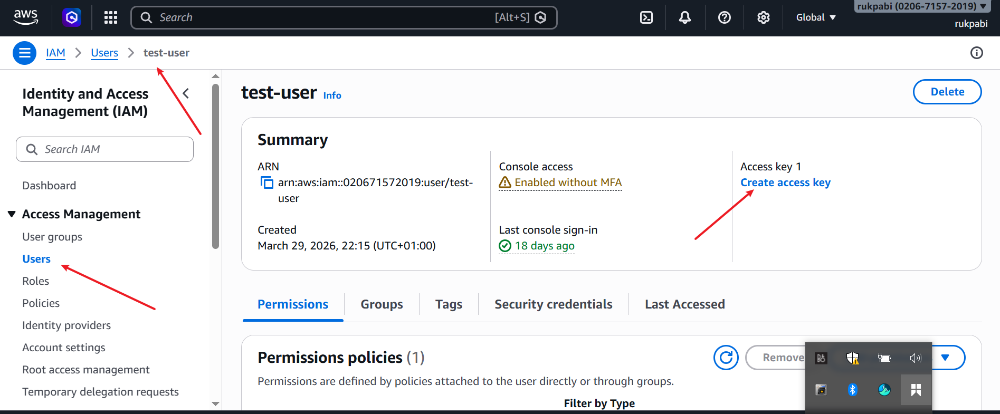
- click create access key
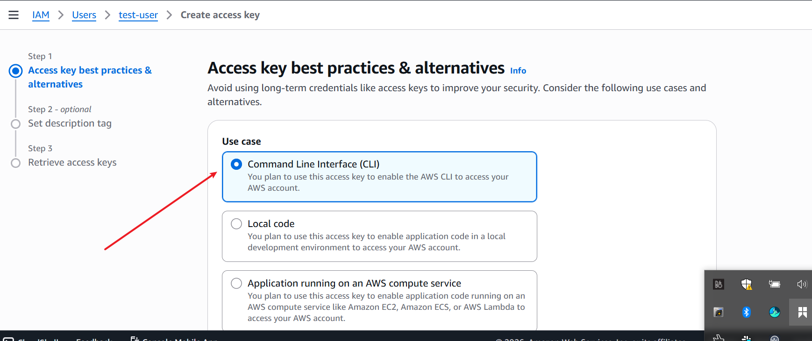
- then confirm and select create access key
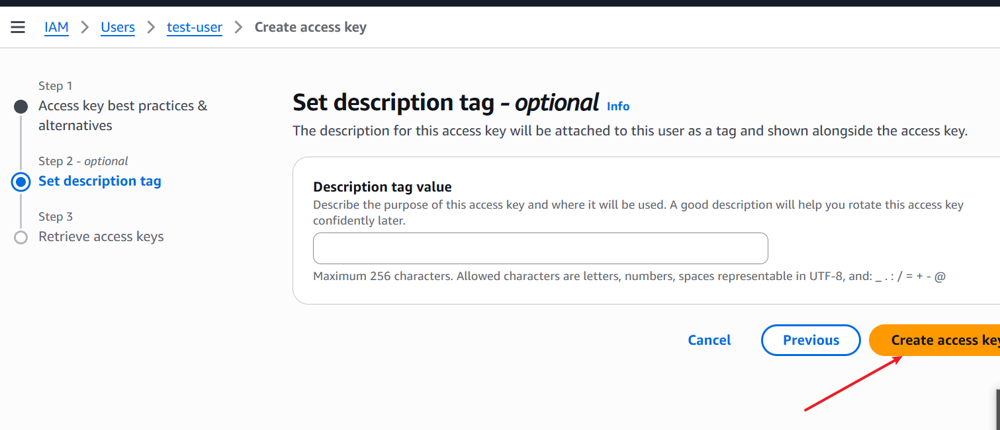
- copy and save the access key and secret access key. You can also download a copy of the the credentials.
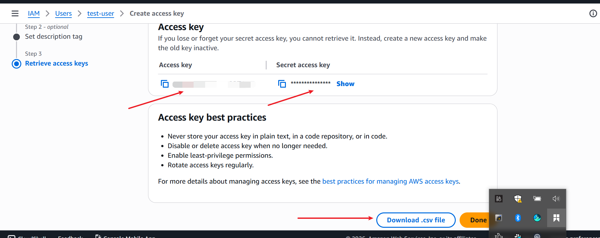

***Step 2***. We will deploy these credentials in our terminal on the request of the command `aws configure`
- call up the bash terminal and run the command   `aws configure`.  Input the aws access key and aws access secret key and aws region as shown below.   
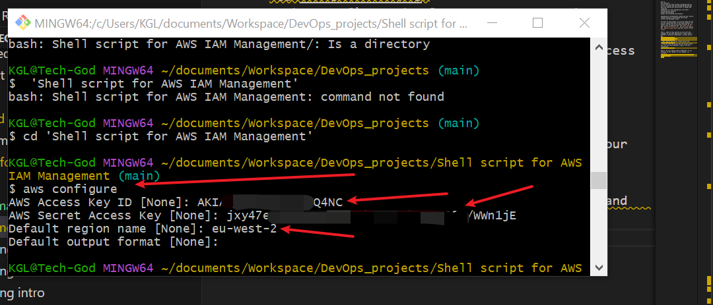

- To confirm we are connected, run the command
`aws sts get-caller-identity`
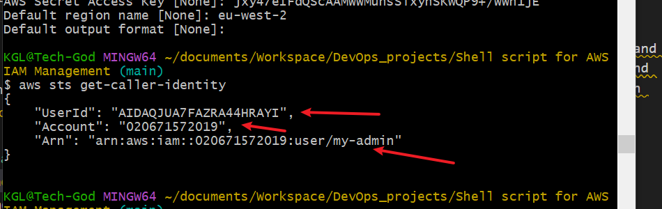

***step 3***. Now that we have successfully bconfigured the aws CLI, we can bnow proceed to `create users`, `create admin group` and `add users to the admin group`.
Step 3 will be creating the users.Using the following script and creating users named `IAM_USER_NAMES=("devops1" "devops2" "devops3" "devops4" "devops5")`. To create the users, we will use the script below
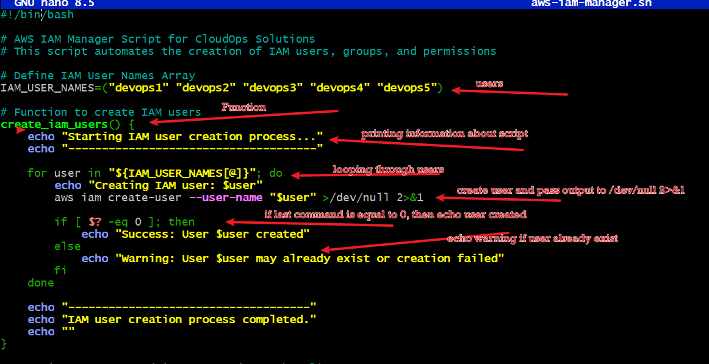.

This script uses variable  `IAM_USER_NAMES` with users, devops1,devops2,devops3,devops4,devops5.

***Step 4****. The next is to create the admin group, consider the below script
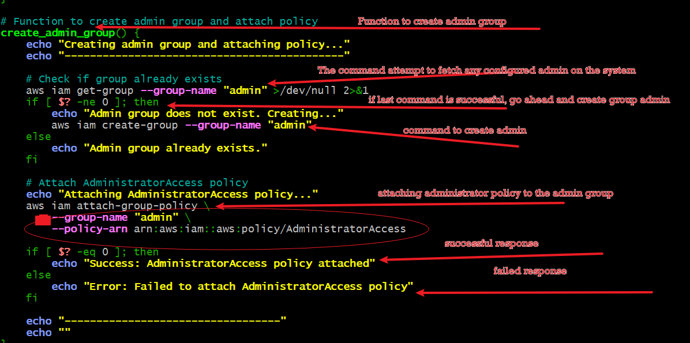

***Step 5***. This is step is where we add the users to the created admin group using loop of users already created.
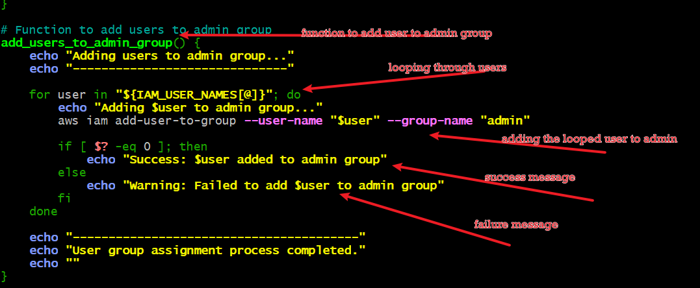
***Step 6***. This step runs the script to execute the functions earlier created.
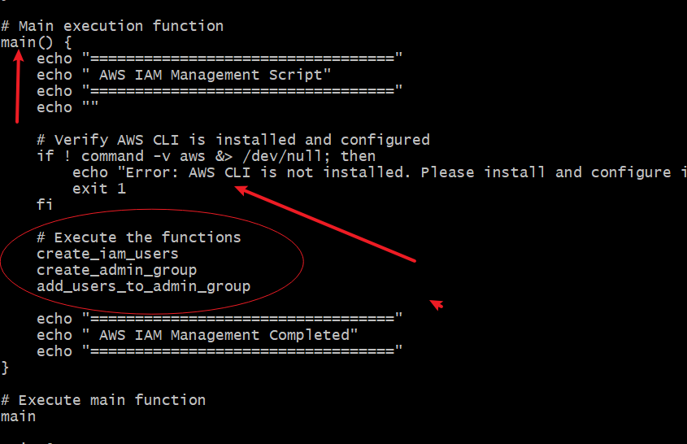

Running the command `bash aws-iam-manager.sh` This will run and create the commands in the script.
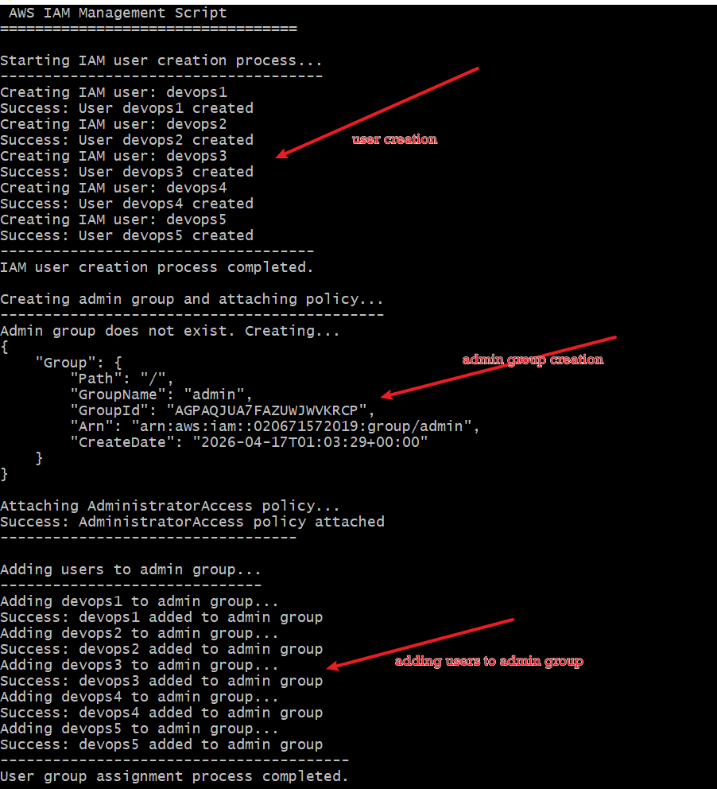
 - Execute the functions
    `create_iam_users`
    `create_admin_group`
    `add_users_to_admin_group`

***Step 6***. we will now run commands to confirm what has been created. To confirm and verify user created we run the command. 
- `aws iam list-users`
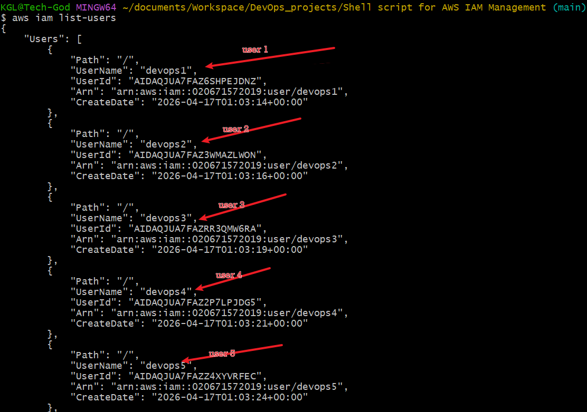

To confirm and verufy the group, we run the command
- `aws iam get-group --group-name admin`
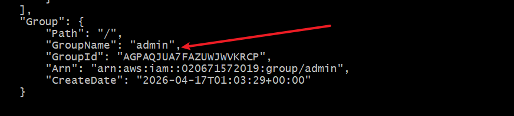

End of project.