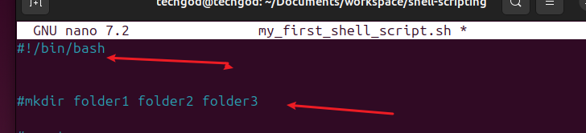
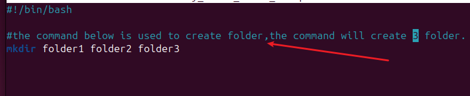
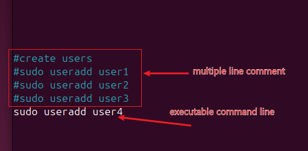

# Linux shell script Comment

Comment are essential in programming, serving as notes to the programmer and anyone else who might read the code.

There are 2 types of comment.
- single line comment
- Multiple line comment

To write a script, 
1. In writing a script, we start off with a 
2. Single line comment: Single line comment in bash is denoted by the symbol #, in this case, it tells us that line of command is used in creating folders.

3. Multiple line comment: These are multiple hash, added to several lines of code so they are not executed. They also give an an indication of the command line. see below

Best practices for commenting are highlighted below

- Clarity: Been clear and concise
- Maintainability: Keep comment updatedd always.
- Usefulness: Comment when it needed, making it useful
- Avoid over commenting: limit commenting and dont comment on every line of code.

That marks the end of the project.