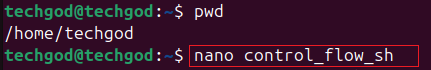
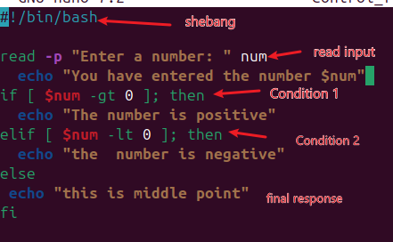
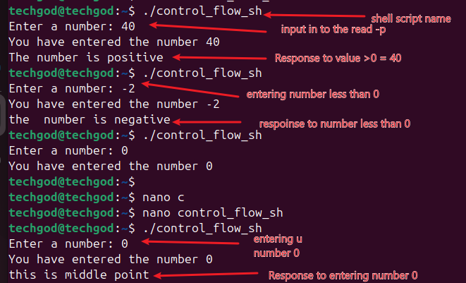
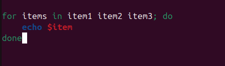
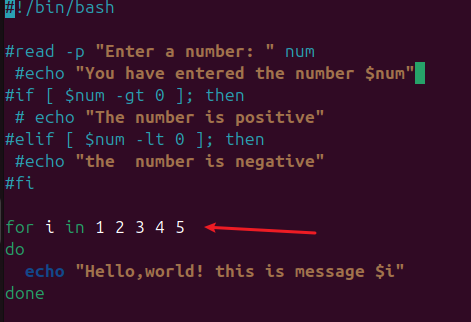
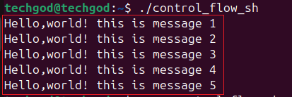
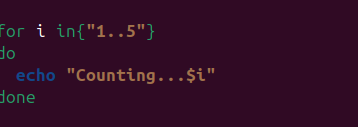
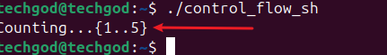
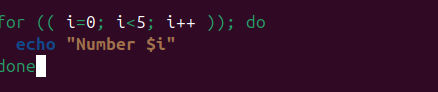
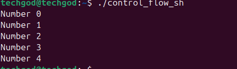

# Control flow in shell scripting

Control flow directs the order in which commands or instructions are executed in a script.

The following represents the various control flows
*
- ****if-else****
- ****for**** loops
- ****whole loop**** 
- ****case****

Task.

1. 

2. 

The screen shot above shows inputing the shebang

3.
 Entering the command `read -p "Enter a number: " num` : This command ask the question,   `enter a number` and allow you to take input. the -p flag option displays on the screen.
Executing the script, refer to , displays the question on the screen. 

4. 

Adding echo command `You have entered the number $num` help to confirm stdout with stdin and displays that on the screen.

## If statement
The *if statement* gives the condition that needs to be evaluated.
`if [ $num -gt 0]; then`, this statement reads, if *$num* is greater than 0, *then* carry out the corresponding comment.
echo " This number is positive."

 **then :** if the command is true, execute the commands that follows the key word

## elif statement.
The elif statement, like the if statement also allows an evaluation of a second condition. In this case, `elif [ $num -lt 0 ]; then` this command dictates: when the `if statement` is not satisfied, the elif statement is activated and it reads: if $num is less than 0, then execute the next line. The next line is an echo statement which states: `this number is negative`.

## else statement
The else statement finishes the line of command as it echo anything other than falls outside the condition of greater than and less than 0. which rightfully echo's: this is the middle point.

 **fi:** This end the if statement.

## Loop
Loops are used to perform repeated task without having to write new codes. real life cases in 

- Batch processing
- Data Analysis
- Automatic testing 

In batch scripting, there are 3 types of loops,

1. For
2. While
3. Until

### For loop: 
This is used to iterate over a list of values or a range of number.it is particularly useful when you know how many iteration in advance.

for loops, have 2 main forms.

1. **List forms**: iterates over a list of items. Basic syntax is show below

**f**or: This is the key word that kicks of the loop
**item**: This is the variable that holds the value of each item.

**in**: this show the range of the items to be iterated over.

**;**: used to seperate the list of items from the `do` keyword
**do :** this precedes the block of command.

**done**: This marks the end of the script.

Task
--
1. list form type
-----

 the resultant effect of the above script is seen below.

Taking a look at the 
for i: specifies that for each number, take that  in turn or in loop at do the echo statement of 'Hello, world! this is message $i.

2. Using the range syntax type

----

 and running ths command we get 

The print out, though not exactly like the other command output but still gave us counting from 1 to 5.

3. C sytle type
---
The C style uses initialization,condition and increment/decrement in the code. 
As seen above, the 
i=o; is the initialization, showing the starting point

i<5; give the condition that must be met

i++ show the increment expected

This shows the printout of the code.

This end the project work.

