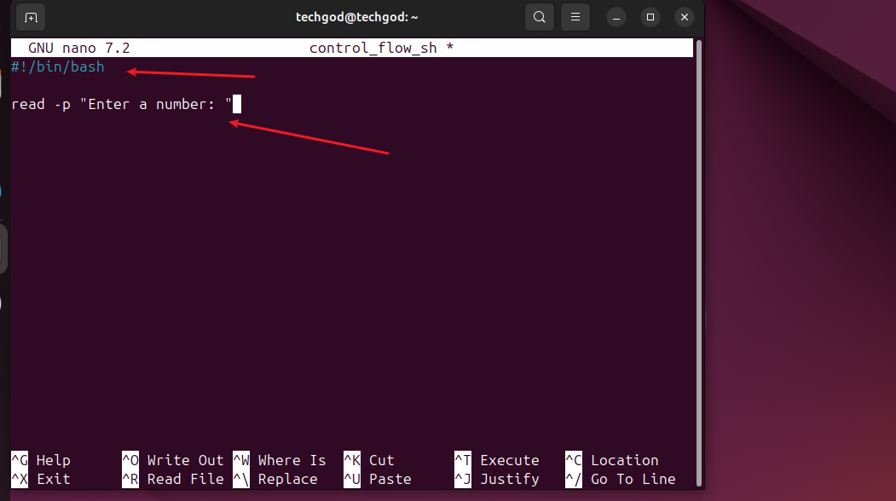
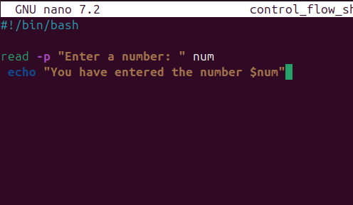
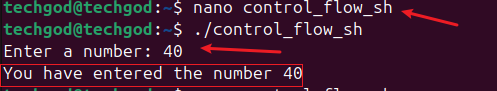
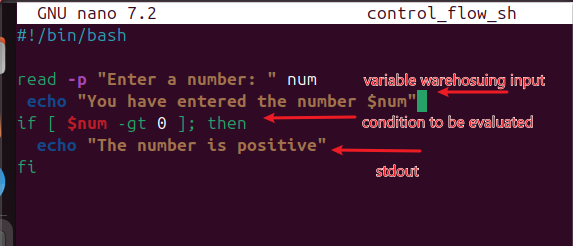
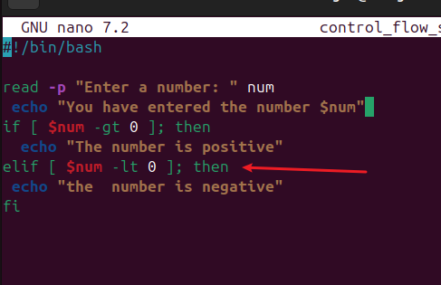
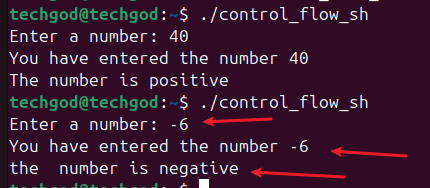

# Control flow in shell scripting

Control flow directs the order in which commands or instructions are executed in a script.

The following represents the various control flows
*
- ****if-else****
- ****for**** loops
- ****whole loop**** 
- ****case****

Task.

1. Create a file and name it `control_flow.sh`. 
2. put the code and execute the script. 
Breaking down the above script, 
- the `#/bin/bash` command is known as shebang and tells the operating system to treat the file as a shell script.
- the `read -p` command takes input and stores it in a variable.
3. Executing the script 
executing the script, the read -p command requests a number to be inputted. Modifying the script and adding an echo command  and the subsequent response from modified script  The value of the `stdin` is seen returned as `stdout`.

## If statement
The if statement in bash allow you to execute command based on certain conditions.

The syntax for the command is 
if [ condition ]; then
    comment
fi.
 Breaking it down:

 **If:** start the command line

 **[ condition ]**: this is the condition to be evaluated.

 **then :** id the command is true, execute the commands that follows the key word.

 **fi:** This end the if statement.

Bringing this into practice, examine the output of the script below.
The value returned as a result of the input from the read statement is now used in the condition above
[$num -gt 0] 
- **$num**: is the variable (stored output from read statement)

- **gt**: flag for greater than

This equate that if the stored value (variable) is greater than O,  echo or return the echo statement '
the number is positive'

## elif statement: 
elif is the keyword used right after an if or another elif command. It allows us to specify another condition. 
the resultant effect of the elif command is seen below
.
when a negative number lower than 0 is inputed, the second condition comes into effect. Hence the response of the number is negative.

## Loop
Loops are used to perform repeated task without having to write new codes. real life cases in 

- Batch processing
- Data Analysis
- Automatic testing 

In batch scripting, there are 3 types of loops,

1. For
2. While
3. Until

### For loop: 
This is used to iterate over a list of values or a range of number.it is particularly useful when you know how many iteration in advance.

for loops, have 2 main forms.

1. **List forms**: iterates over a list of items. Basic syntax is show below

**f**or: This is the key word that kicks of the loop
**item**: This is the variable that holds the value of each item.

**in**: this show the range of the items to be iterated over.

**;**: used to seperate the list of items from the `do` keyword
**do :** this precedes the block of command.

**done**: This marks the end of the script.

Task
--
1. list form type
-----

 the resultant effect of the above script is seen below.

Taking a look at the 
for i: specifies that for each number, take that  in turn or in loop at do the echo statement of 'Hello, world! this is message $i.

2. Using the range syntax type

----

 and running ths command we get 

The print out, though not exactly like the other command output but still gave us counting from 1 to 5.

3. C sytle type
---
The C style uses initialization,condition and increment/decrement in the code. 
As seen above, the 
i=o; is the initialization, showing the starting point

i<5; give the condition that must be met

i++ show the increment expected

This shows the printout of the code.

This end the project work.

