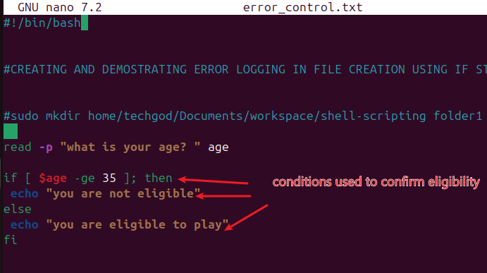
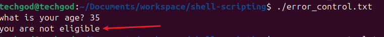
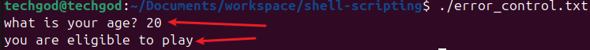

#  Error handling in shell scripting

Error handling in shell scripting is a crucial aspect of scripting that involves anticipating and managing errors that may occur during script execution. In handling these errors, two things are crucial to consider ,
1. Identify potential errors that may arise due to user input validation, file operation etc that could impact script execution.
2. Use conditional statement, this involves the use of if, elif and else statement to check for error conditions and respond appropriately.
When errors occur, it is always good to provide descriptive error messages that clearly indicate what went wrong and users can resolve it.

Reviewing the above script, the condition `age -gt 35` helps to confirm eligilibity when user input their age in the program enhanced by the `read -p` input command. 
for ages >= 35, the program echo's they are not eligible, while ages younger than 35 are eligible..
For ages < 35, the program echos they are eligible. 

This above gives credence to the error handling capability of the if statement.

This ends the project work
