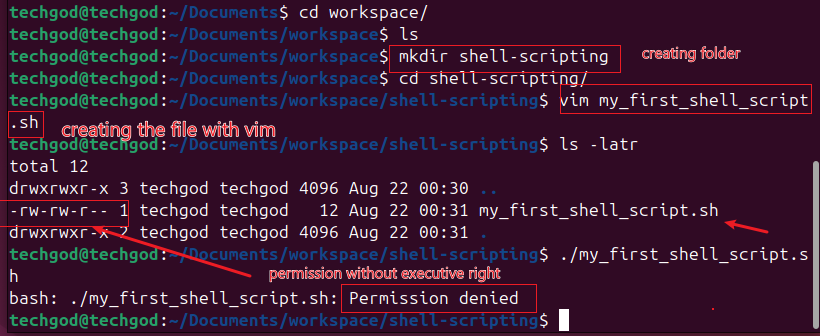
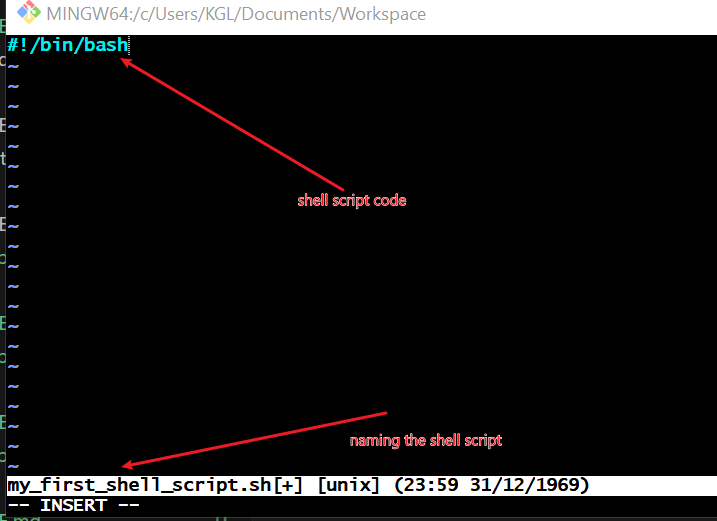
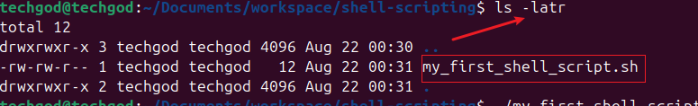
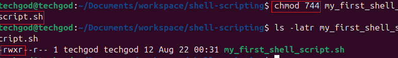
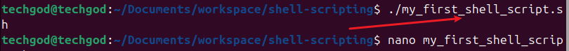
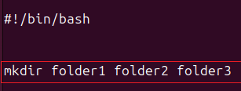
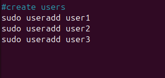
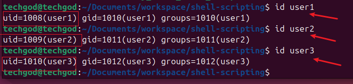

 # Shell scripting

 Shell scripting is the process of writing and executing a series of instructions in a shell to automate task.
 A shell script is essentially a script or program written in a shell language such as ***`Bash`***,***`sh`***,***`zsh`*** or ***`powershell`***

Task 1:
--
1. Create a folder on ubuntu server and name it shell-scripting

The above shows the creation folder after which
2. a file was created using vim command. The file was created and a shell script code was appended as seen below screen shot. 
3. To check if the file was created correctly, we ran the command ls -latr as seen below

Task 2
--
1. Clearly, the owner can not execute the script because he does not have the executive permission. To enable this we run the command `chmod 744 filename`

2. Run the shell script to test it . This is done by typing the command ./my_first_shell_script.sh to show that the script is now running.

3. create 3 folders using the shell script as sen below
 and confirming the folders created by running ls in the shell script folder

4. creating 3 users by running the command sudo useradd user1, sudo useradd user2,sudo useradd user3. screen shot below
 and confirming the id's of teh users 

## Variable declaration & initialiazation

That marks the end of the task