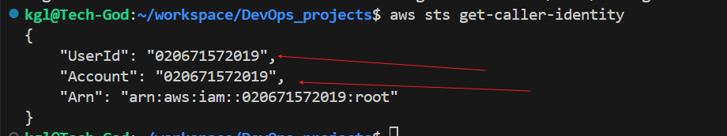
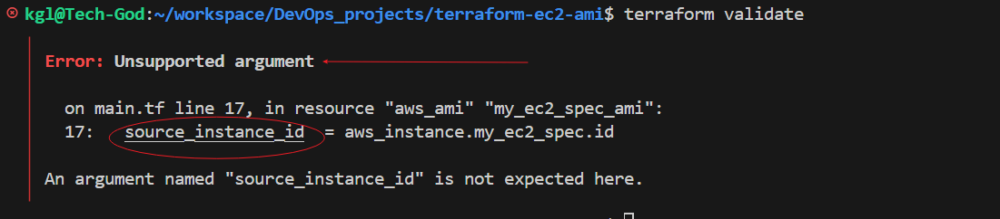
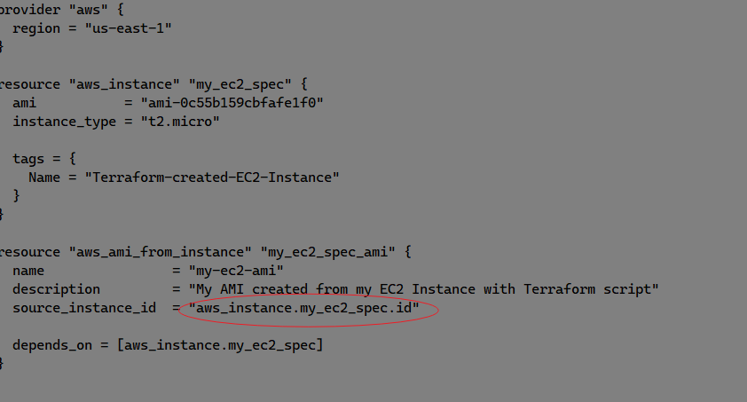
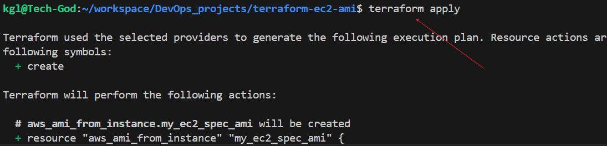
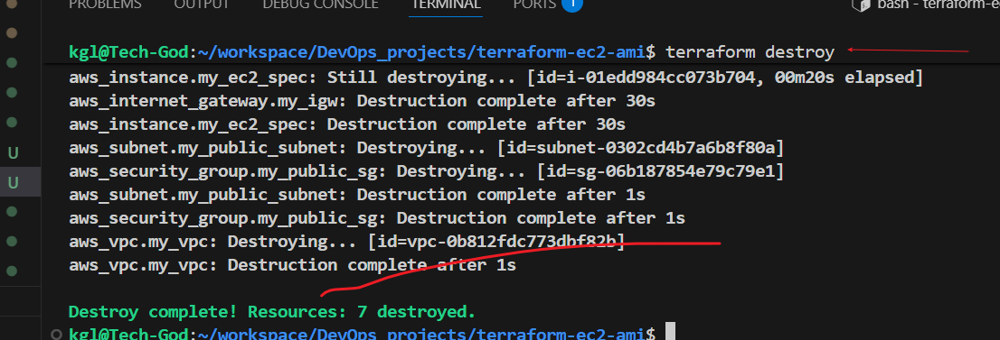

Terraform EC2 Instance and AMI Creation

Submit Project

Share Project
Mini Project - Terraform EC2 Instance and AMI Creation
In this mini project, you will use Terraform to automate the creation of an EC2 instance on AWS and then create an Amazon Machine Image (AMI) from that instance.

Objectives
Learn how to write basic Terraform configuration files.
Learn how to write Terraform script to automate creation of an EC2 instance on AWS.
Learn how to use Terraform script to automate the creation of an AMI from an already created EC2 instance on AWS.
Prerequisites
This project requires you to have an AWS Account and the AWS CLI configured to it locally. This setup will be used by the Terraform script you are going to write. From your local command line interface, Terraform will use the configured AWS CLI credential to communicate with your AWS Account when executing the script.

Ensure you have an AWS Account created and functional. You may see a guide here to create a new AWS account.
Ensure you have the AWS CLI installed and configured with the credentials of your AWS Account. You may see a guide here
Ensure you have Terraform installed on your computer. You may see a guidehere
Tasks Outline
Confirm the Prerequisites
Write the Script
Execute the Script
Initialize [init]
Validate [validate]
Plan [plan]
Apply [apply]
Confirm Resources
Clean up
Destroy [destroy]
Project Tasks
Task 1 - Confirm the Prerequisites
Login into your AWS Account to confirm it is functional.
Run aws --version on your terminal to confirm the AWS CLI is installed. You should see an output similar to thisinstalled AWS version
Run aws configure list to confirm the AWS CLI is configured. You should see an output similar to thisAWS Configure List
Run aws sts get-caller-identity to verify that the AWS CLI can successfully authenticate to your AWS Account. You should see an output similar to thisAWS Caller Identity
Run terraform --version to confirm Terraform is installed. You should see an output similar to thisinstalled Terraform version
Task 2 - Developing the Terraform Script to create EC2 Instance and AMI from it
Create a new directory for this Terraform project: mkdir terraform-ec2-ami and cd terraform-ec2-ami.
Inside this directory, create a Terraform configuration file: nano main.tf.
Inside this file, write the script to create an EC2 instance specifying instance type, ami, and tags. Extend this script to include the creation of an AMI from the created EC2 Instance. (See sample below)

Copy
provider "aws" {"\n  region = \"us-east-1\"  # Change this to your AWS Account region\n"}

resource "aws_instance" "my_ec2_spec" {"\n  ami           = \"ami-0c55b159cbfafe1f0\"  # Specify your desired AMI ID\n  instance_type = \"t2.micro\"\n\n  tags = {\n    Name = \"Terraform-created-EC2-Instance\"\n  "}
}

resource "aws_ami" "my_ec2_spec_ami" {"\n  name        = \"my-ec2-ami\"\n  description = \"My AMI created from my EC2 Instance with Terraform script\"\n  source_instance_id = aws_instance.my_ec2_spec.id\n"}
Script Explanation
This script creates an EC2 instance and then creates an AMI from that instance.

Provider Block
provider "aws" tells Terraform to use AWS as the cloud provider
region = "us-east-1" specifies which AWS region to use
EC2 Instance Creation
resource "aws_instance" "my_ec2_spec" creates an EC2 Instance
ami = ami-0c55b159cbfafe1f0" specifies the Amazon Machine Image ID to use for the instance
instance_type = "t2.micro" defines the EC2 Instance type
The tag block adds a name tag to the instance for identification
AMI Creation from the EC2 Instance
resource "aws_ami" "my_ec2_spec_ami" creates an AMI from the EC2 Instance
name = "my-ec2-ami" names the new AMI
source_instance_id = aws_instance.my_ec2_spec.id uses the EC2 Instance to create the AMI
Task 3 - Executing the Terraform Script
Initialize the Terraform project using terraform init *
Validate the correctness of this script using terraform validate
Confirm the resources that will be created by the execution of this script using terraform plan
Apply the Terraform configuration using terraform apply
Task 4 - Confirm Resources
Confirm the creation of the EC2 Instance and its AMI in your AWS Account according to the specified details.

Task 5 - Clean up
Execute command terraform destroy to clean up the resources created by the script.

Documentation
Document your observations and any challenges faced as you carried out this project.

Terraform Remote State Backend using S3 and DynamoDB

## Project Tasks
### Task 1 - Confirm the Prerequisites
1. Login into your AWS Account to confirm it is functional.
2. Run aws --version on your terminal to confirm the AWS CLI is installed

3. Run aws configure list to confirm the AWS CLI is configured. You should see an output similar this

4. Run aws sts get-caller-identity to verify that the AWS CLI can successfully authenticate to your AWS Account. 

5. Run terraform --version to confirm Terraform is installed.

### Task 2 - Developing the Terraform Script to create EC2 Instance and AMI from it

1. Create a new directory for this Terraform project: mkdir terraform-ec2-ami and cd terraform-ec2-ami.
!directory
2. Inside this directory, create a Terraform configuration file: nano main.tf

3. Inside this file, write the script to create an EC2 instance specifying instance type, ami, and tags. Extend this script to include the creation of an AMI from the created EC2 Instance. (See sample below)

## Script Explanation
This script creates an EC2 instance and then creates an AMI from that instance.

1. Provider Block
provider "aws" tells Terraform to use AWS as the cloud provider
region = "us-east-1" specifies which AWS region to use

2. C2 Instance Creation
resource "aws_instance" "my_ec2_spec" creates an EC2 Instance
ami = ami-0c55b159cbfafe1f0" specifies the Amazon Machine Image ID to use for the instance
instance_type = "t2.micro" defines the EC2 Instance type
The tag block adds a name tag to the instance for identification

3. AMI Creation from the EC2 Instance
resource "aws_ami" "my_ec2_spec_ami" creates an AMI from the EC2 Instance
name = "my-ec2-ami" names the new AMI
source_instance_id = aws_instance.my_ec2_spec.id uses the EC2 Instance to create the AMI

### Task 3 - Executing the Terraform Script
1. Initialize the Terraform project using terra form init *

Validate the correctness of this script using terraform validate. The validation came up with errors because of the resource name and the impromper identitation, This was corrected before validation.
 and 

Confirm the resources that will be created by the execution of this script using terraform plan

Apply the Terraform configuration using terraform apply

## Task 4 - Confirm Resources
Confirm the creation of the EC2 Instance and its AMI in your AWS Account according to the specified details.

and 

## Task 5 - Clean up
Execute command terraform destroy to clean up the resources created by the script.

Documentation
Document your observations and any challenges faced as you carried out this project.
1. Due to the fact that my original VPC had been deleted while practicing, the terraform was not creating my INSTANCE because it coould not find default VPC i needed to add file for each network component to make my terraform work. i create a VPC,TELNET,ROUTE,SECURITY GROUP before it could work. This made changes where made to the file main.