# Introdution to Docker images

Docker images are the building blocks of containers. They are light weight, portable, self sufficient packages that contain everything that is needed to run a software application. Including the code, runtime environment, libraries and system tools. Images are created from sets of intructions and configuration inside a Dockerfile.

## Pulling docker images

Docker hub is a cloud based registry that stores a vast collection of images. These images can be pulled directly to you local machine by running the *`docker pull`* command. You can also search for images when you run the *`docker search`* command.

1. Docker search command: Using the docker search command, we can search for particular image
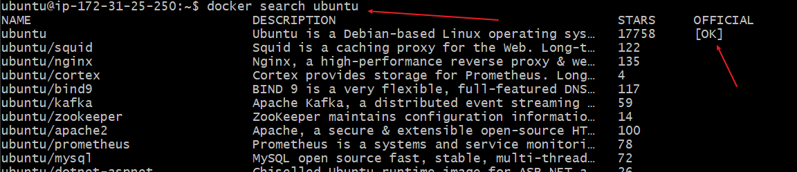. This command allows you to explore the various images hosted on the docker registry.

**NOTE**: The OK column indicates that the particular image has been constructed and is supported by the organisation responsible for the project.

To pull the image to your local machine, you run the command *`docker pull`*.

2. Docker pull command: Using the docker pull command, we pull image to our local repository or machine.
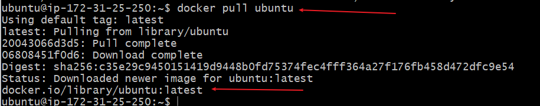. 
In this case, we just pull an ubuntu image.

3. Docker list images: Using the command *`docker images`*, you can list images downloaded on your system.
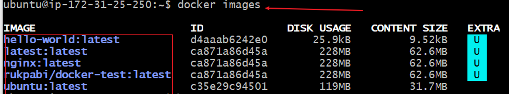. Running this command shows a comprehensive list of all downloaded images, with their image id, version, size and other details.

## Dockerfile

A docker file is a plain text configuration file that contains set of intructions for building a docker image.Dockerfile are a blueprint for producing consistent images since they warehiouse all the configuration and dependencies required to build the image and eventual container.

### Creating a dockerfile
A Dockerfile is a file that contains the instructions and configurations to build an image. Using an nginx image *`which is a web image`* we will build a dockerfile to display a message on the web. In the Dockerfile, we will specify the nginx image to display the content of an *index.html* file. Note, the nginx and index.html file should be in the same folder.
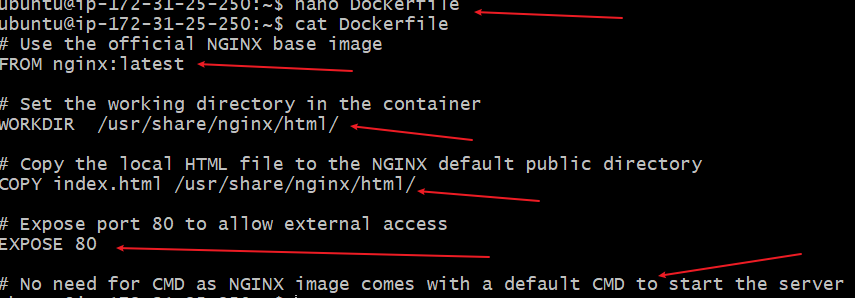
Explanation of each code snippet.
1. FROM nginx:latest - This specifies we are using nginx as ouir base image, with a latets tag.
2. WORKDIR /usr/share/nginx/html: This is nginx native directory. nginx will publish content of file dropped in this path.

3. COPY index.html /usr/share/nginx/html: This command copies the index.html file from the current directory to the nginx native path. /usr/share/nginx/html.

4. EXPOSE 80: This command tell docker that nginx server will use port 80. Though this is purely for documentation purpose, the port is specified as part of the `run` command.

5. CMD: This command specifies where to start the nginx server. It is not specified in this case because nginx comes with a dafault CMD to start the server.

### Building our Docker image / container.
A file named index.html with content `echo 'Welcome to darey.io' >> index.html`
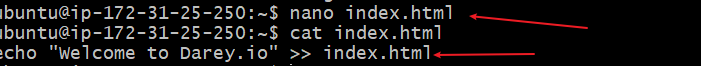

To build the image from the Dockerfile, we navigate and run the command from the folder containing the file.

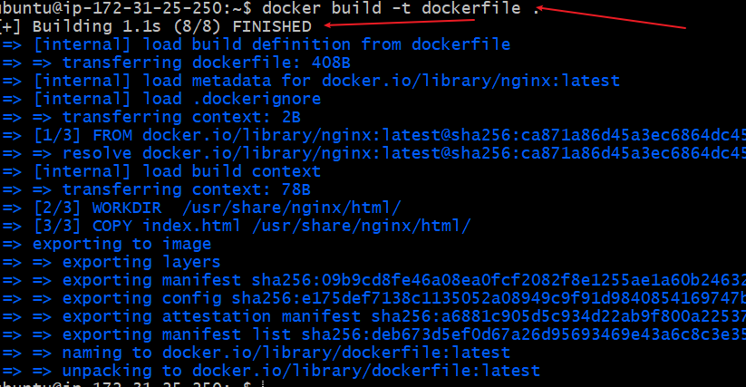
This builds the image

To run a container using the built image, we run the command `docker run -p 8080:80 dockerfile`. This command maps the container local port 8080 to nginx port 80.
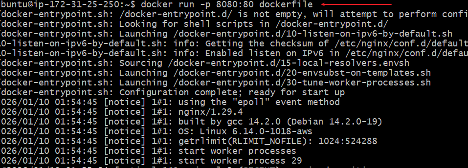

Running the command above, will create a conatiner listening on port 8080. We now need to allow traffic from port 8080 on our EC2 instance.
Log on to the EC2 instance and navigate to security
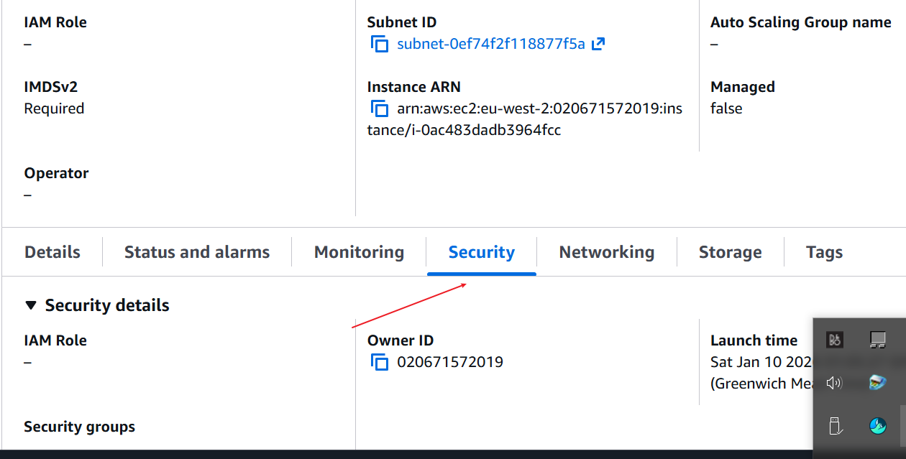

click on edit inbound rules to add new rule
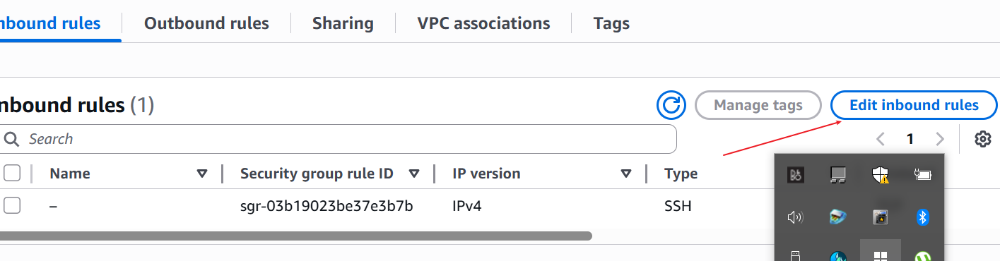.

Add port 8080 and save new rule.

Run the command `docker ps -a` to see all containers.
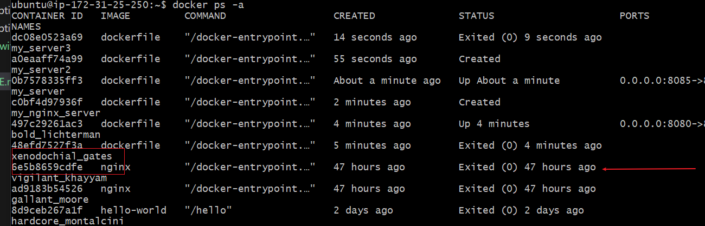

To start the container with ID , we run teh command docker start CONTAINER_ID
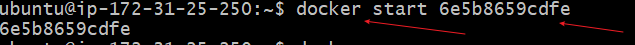

Now that the container is running, we can view that and the content in the browser by using the public ip of our EC2 server with the port 8080. http://public_ip:8080

### Pushing Docker images to docker hub

To push our image to docker hub. We need to have an account in docker hub. The following are prerequisite needed before psuhing an image to docker hub.
1. Create an account on docker hub

2. Create a repository on docker hub

3. Tag your docker image before pushing it

4. Push the image to docker hub

5. Verify the image in docker hub registry.

## Side hustle task: Dockerize a web static page.

1. Launch an EC2 instance and create a Docker file
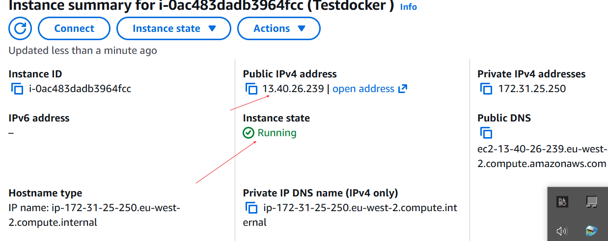
 1.b create docker file with nginx image.
 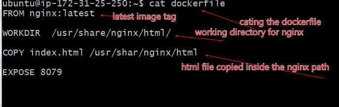
2. Build the Docker image
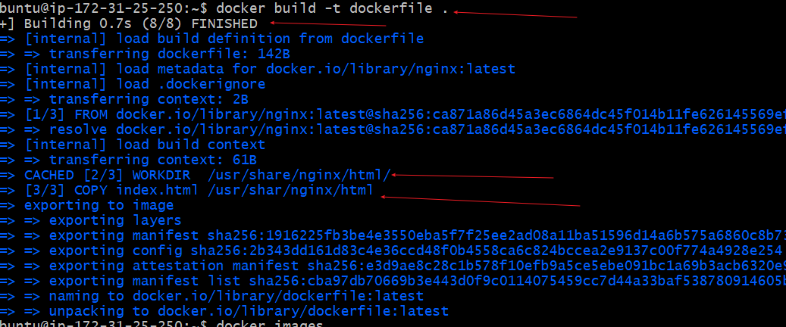, run the command *`docker build -t dockerfile .`*
3. Run the Docker container
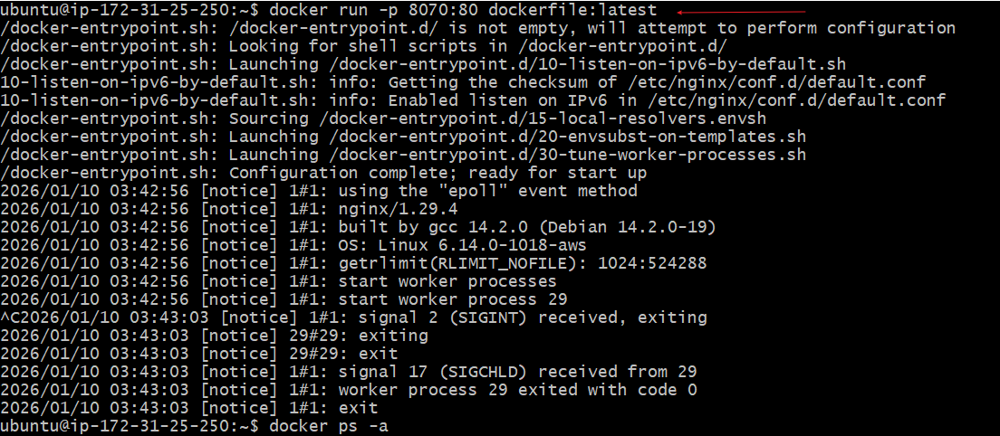
using the command *`docker run -p 8070:80 dockerfile:latest`*
4. Verify in browser
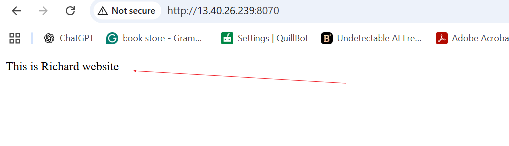

### Push Image to docker hub.

1. Login to docker hub
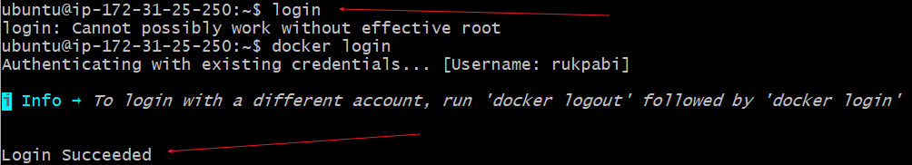

2. Tag the images
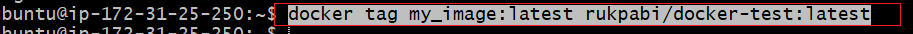

3. Push image to docker hub

