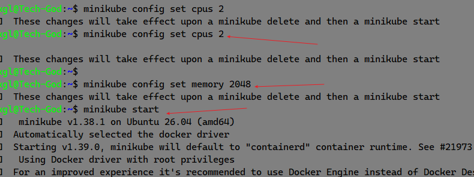
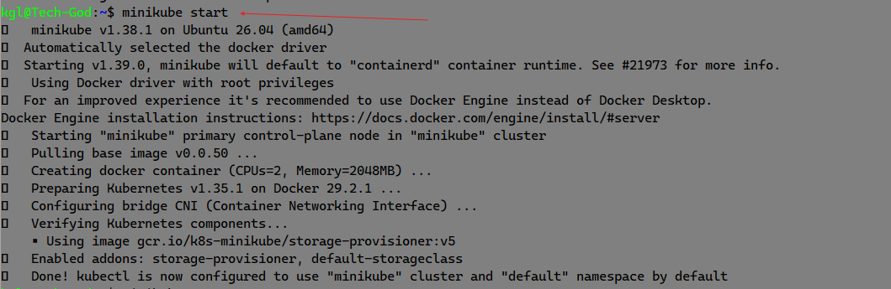
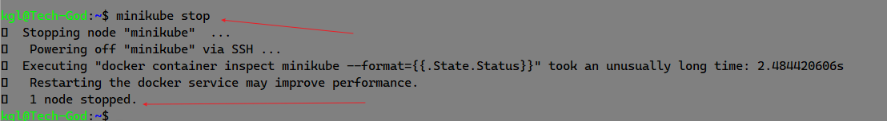
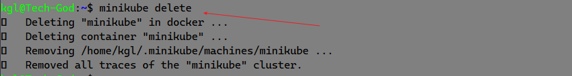
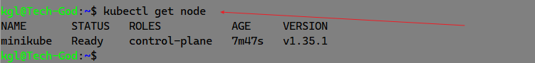
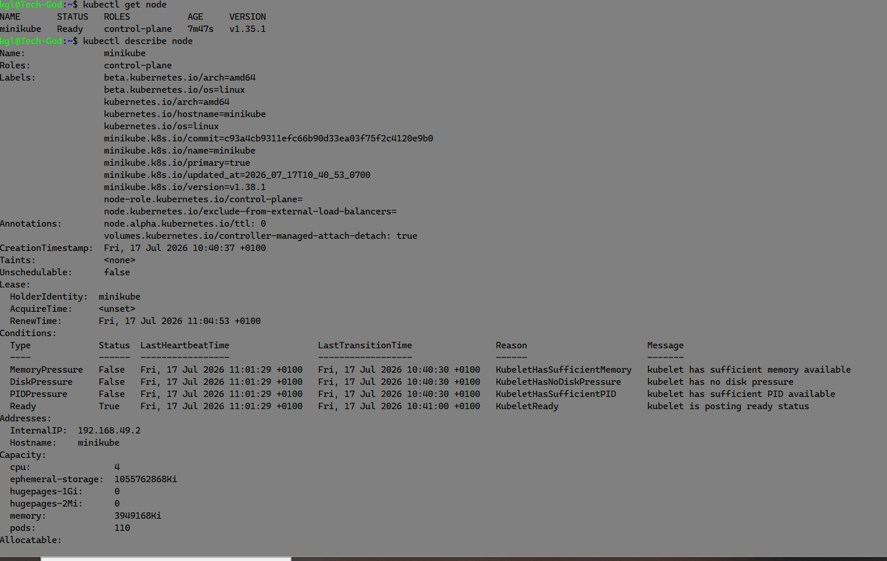

Working with Kubernetes Node

Submit Project

Share Project
Working with Kubernetes Nodes
Kubernetes Nodes
Now that we have our minikube cluster setup, let's dive into nodes in kubernetes

What Is a Node
In Kubernetes, think of a node as a dedicated worker, like a dependable employee in an office, responsible for executing tasks and hosting containers to ensure seamless application performance. A Kubernetes Node is a physical or virtual machine that runs the Kubernetes software and serves as a worker machine in the cluster. Nodes are responsible for running Pods, which are the basic deployable units in Kubernetes. Each node in a kubernetes cluster typically represents a single host system.

Managing Nodes in kubernetes:
Minikube simplifies the management of Kubernetes for development and testing purposes. But in the context of minikube (a kubernetes cluster), we need to start it up before we can be able to access our cluster.

Start Minikube Cluster:

Copy
minikube start
This command starts a local Kubernetes cluster (minikube) using a single-node Minikube setup. It provisions a virtual machine (VM) as the Kubernetes node.

Stop Minikube Cluster:

Copy
minikube stop
Stops the running Minikube (local kubernetes cluster), preserving the cluster state.

Delete Minikube Cluster:

Copy
minikube delete
Deletes the Minikube kubernetes cluster and its associated resources.

View Nodes:

Copy
kubectl get nodes
Alt text

Lists all the nodes in the kubernetes cluster along with their current status.

Inspect a Node:

Copy
kubectl describe node <node-name>
Provides detailed information about a specific node, including its capacity, allocated resources, and status.

Alt text

Node Scaling and Maintenance:
Minikube, as it's often used for local development and testing, scaling nodes may not be as critical as in production environments. However, understanding the concepts is beneficial:

Node Scaling: Minikube is typically a single-node cluster, meaning you have one worker node. For larger, production-like environments.

Node Upgrades: Minikube allows you to easily upgrade your local cluster to a new Kubernetes version, ensuring that your development environment aligns with the target production version.

By effectively managing nodes in Minikube kubernetes cluster, we can create, test, and deploy applications locally, simulating a Kubernetes cluster without the need for a full-scale production setup. This is particularly useful for debugging, experimenting, and developing applications in a controlled environment.

Project work:
#### Installing minikube: We will be installing minikube on windows where we currently have wsl running an ubuntu version providing a linux kernel for better kubernetes function.

 1. we will run the following command to install minikube on our environment that already has a linux kernel

 // curl -LO https://storage.googleapis.com/minikube/releases/latest/minikube-linux-amd64
sudo install minikube-linux-amd64 /usr/local/bin/minikube

 2. Once minikube is installed, before starting minikube i want to instruct minikube to start up with setting a base cpu and memory usage.
 run the following commands to configure the cpu and memory 
 `minikube config set cpus 2`
 `minikube config set memory 2048`

 

 3. Note that the minkube installed in this environment inherit docker as the driver becaue docker has been pre-installed on the environment, we did not need to run the command
 
 `minikube start --docker=driver` 

 4. Start Minikube Cluster: This command starts a local Kubernetes cluster (minikube) using a single-node Minikube setup. It provisions a virtual machine (VM) as the Kubernetes node
 `run minikube start`
 

 5. Stop Minikube Cluster: minikube stop, stops the running Minikube (local kubernetes cluster), preserving the cluster state.

 

 6. Delete minikube cluster: Deletes the Minikube kubernetes cluster and its associated resources.

 7. kubectl get nodes: Lists all the nodes in the kubernetes cluster along with their current status.

 

 8. kubectl describe node <node-name>:
Provides detailed information about a specific node, including its capacity, allocated resources, and status

### Node Scaling and Maintenance:
Minikube, as it's often used for local development and testing, scaling nodes may not be as critical as in production environments. However, understanding the concepts is beneficial:

Node Scaling: Minikube is typically a single-node cluster, meaning you have one worker node. For larger, production-like environments.

Node Upgrades: Minikube allows you to easily upgrade your local cluster to a new Kubernetes version, ensuring that your development environment aligns with the target production version.

By effectively managing nodes in Minikube kubernetes cluster, we can create, test, and deploy applications locally, simulating a Kubernetes cluster without the need for a full-scale production setup. This is particularly useful for debugging, experimenting, and developing applications in a controlled environment.

End of project work