# Introduction to docker containers

A Docker container is a lightweight, portable package that contains everything an application needs to run—code, runtime, system tools, libraries, and settings—so it behaves the same no matter where it’s run (your laptop, a server, or the cloud)

### Running containers.

To run a container, we use the *`docker run image_name`* command. Using the ubuntu image earlier pulled from the docker hub, we can run the container using the command
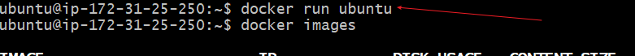

This command builds a container from the ubuntu image but the container stops running as shown in the arrow below.
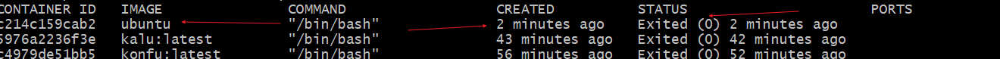
- container started 2 minutes ago
- status shows exited 2 minutes ago
- image is ubuntu

 The container can be started again by using the docker start containe_id command.

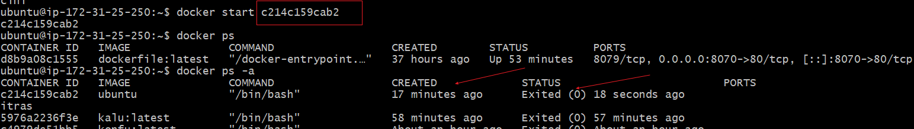

This show container was started 17 seconds ago

### Launching container with different options
Docker provides various ways of customizing the behaivour of containers.For example, you can map ports, mount volumes, specify environment variables and specific /create network segmentation to provide security to certain containers. To illustrate each 

#### map ports
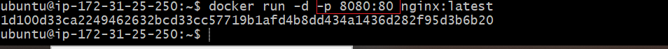 This show the mapping of port 8080 of container to port 80 of the host.

#### environment variable
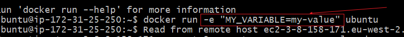 

### Running containers in the Background

Containers by default run in the foreground, to run a container in the background we use a -d flag. This runs the container in the background and allows you to continue working on terminal.
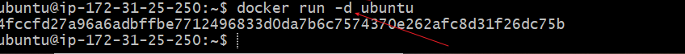

### Container life cycle

Container life cycle includes creating, bstarting, stopping and restarting the container.

1. To start a container, we use the command below. Using the last created container as example, below shows the container status as exited one minute ago.

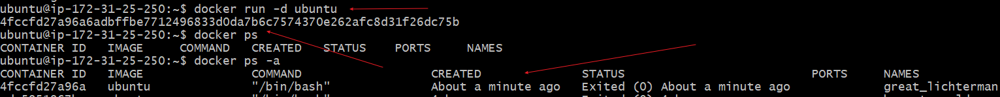.

Starting the container with the command below

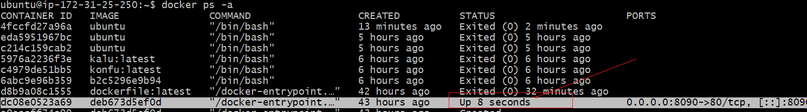

2. To stop the container, we use the command

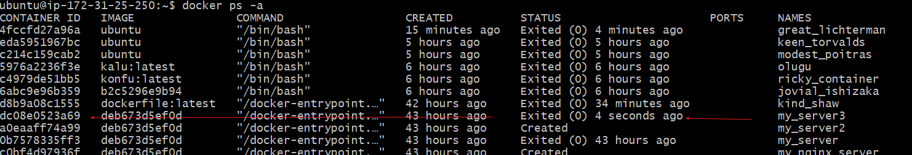

3. To restart the container, we use the command
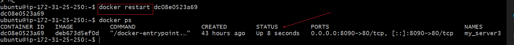

### Removing containers.

4. To remove a container, we use the command *`docker rm`* followed with the container id.
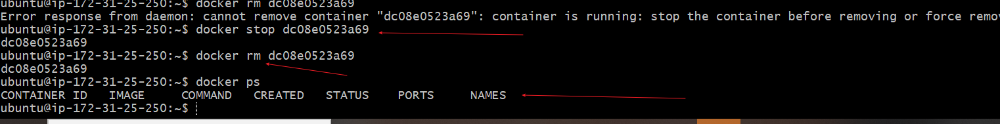

From the above screen shot, we can see that to remove the container, we needed to stop the container, before running the command to remove it.

5. To remove image, we use the command *`docker rmi`* followed with tge image id.

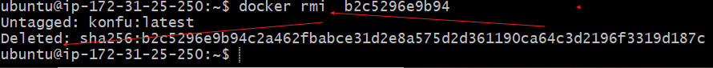

## Side Hustle Task.

1. Start a container and run a simple command
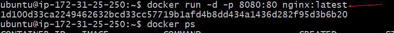

2. To run a command within the running container, we use the command *`docker exec -it`*
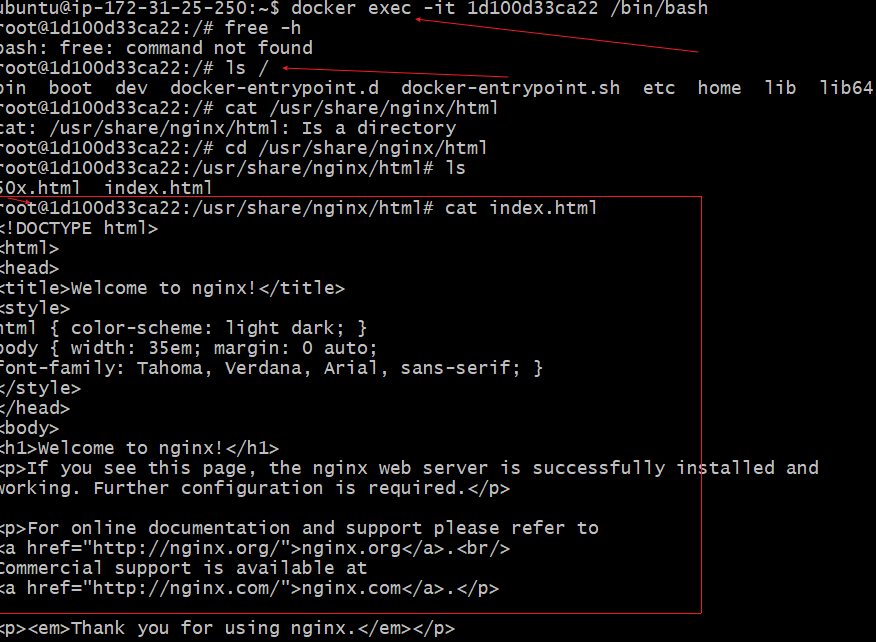

3. Stop container and very changes and status. To do this we run the docker stop command.
From below, we observe that the status of the container reads `exited`
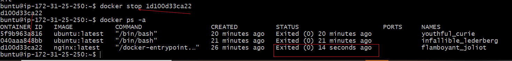

4. Restart the container, with the container restart command
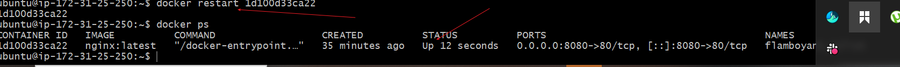
The pictures shows the status of the restarted container as `up`

5. Remove the container with the command 
`docker rm container_id`
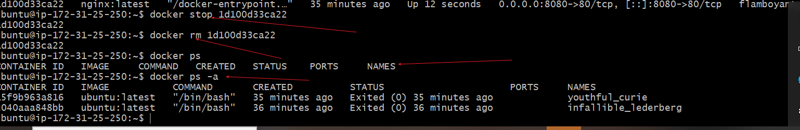
To remove container, we have to stop the container first, then run above command.The pictures confirms the container is stopped before it was removed. it is no longer listed as a container.

