# Jenkins pipeline job

A Jenkins Pipeline is a suite of plugins that supports implementing and integrating continuous delivery pipelines into Jenkins. It allows you to define the entire application lifecycle, from version control to deployment, using code. This code is typically written in a text file called a Jenkinsfile, which is checked into the project's source control repository.

### Creating a pipeline job
Lets create our first pipeline job. 

1. On the jenkins dashboard, click new item

2. Create a pipeline job and name it "my pipeline job"
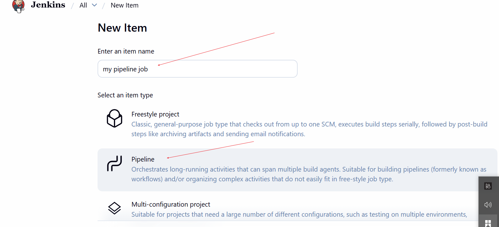

#### Configure build trigger.
We shall now be configuring github hook trigger.
1. on the configuration page, enable github trigger for GITSCM polling 

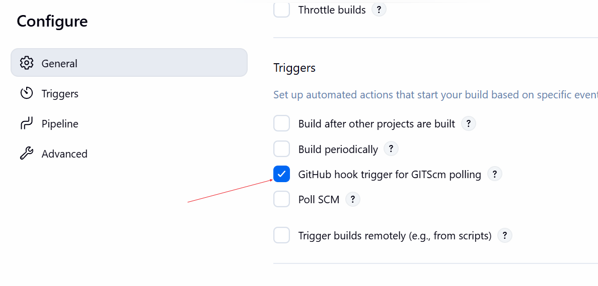

2. Configure the trigger on github as we did in the earlier project. As seen below , the payload uri `the ip address and port `and the content type `application json` were both configured.
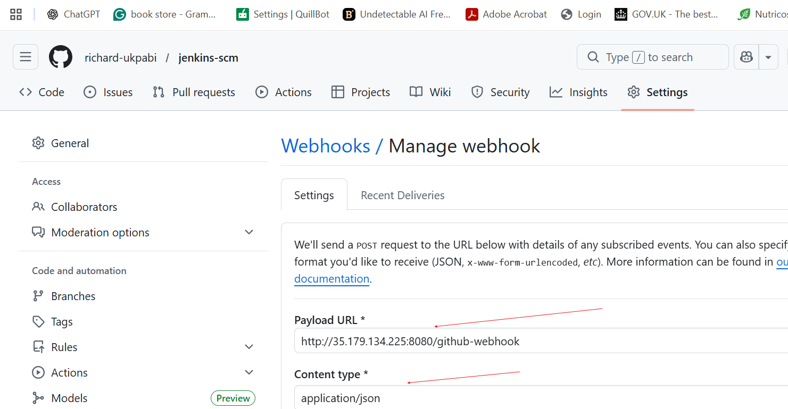

## Writing jenkins pipeline script

A pipeline script is the blueprint for automating your CI/CD process. It defines what happens, when it happens, and how it happens in your software delivery workflow.
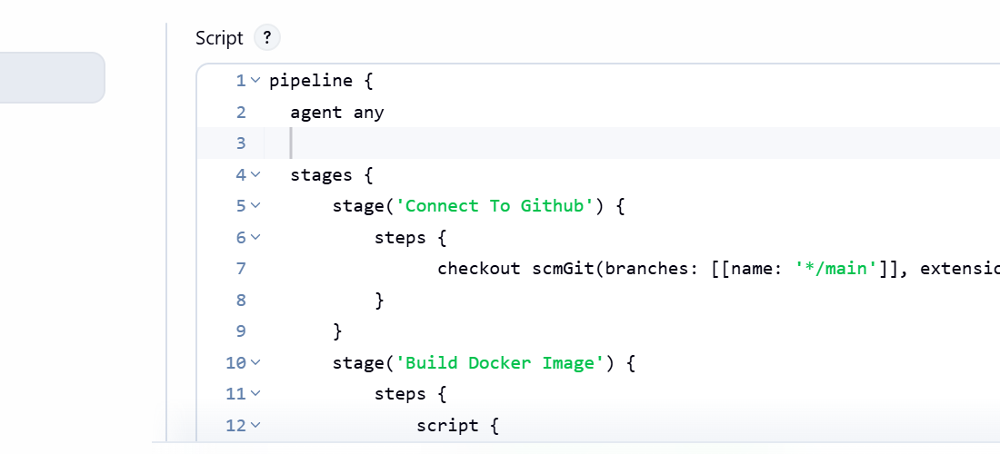

With respect to the above screen shot, the following explains each line of the file.
1. 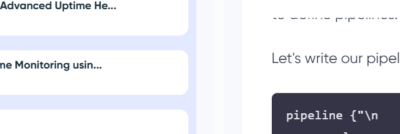
Pipeline: The script written in JSON is first started with a line `pipeline` as seen above. This encapsulate the body of the script.

2. agent any: This specifies that the agent can run on any platform. when an agent is configured to use by the pipeline, either stationary or cloud pipeline, the line becomes simply `agent`
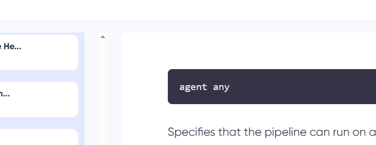

3. stages:  This defines various stages of the pipeline,each representing a phase in software delivery process.
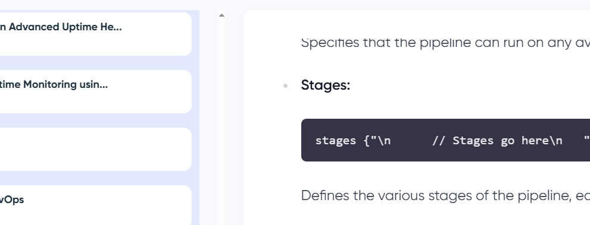

4. steps: steps within the stages actually define the actual code to
 be ran.

### Now explaining the content of each stage.

5. stage_1: `connect to github`This stage checks out the source code from the git repository.
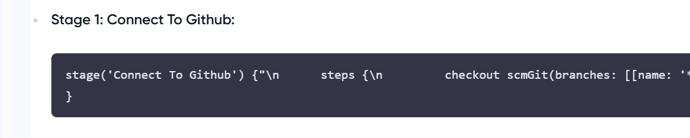

6. stage_2: `Build the docker image` This stage build an image from the source code obtained from github.
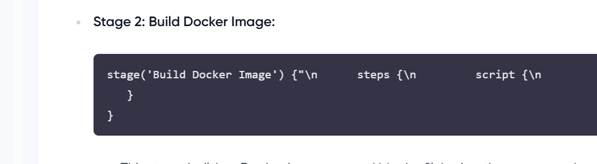

7. stage_3:`Containerize the image` This stage builds an nginx container from the image, mapping the container's port 80 to port 8081 of the host.
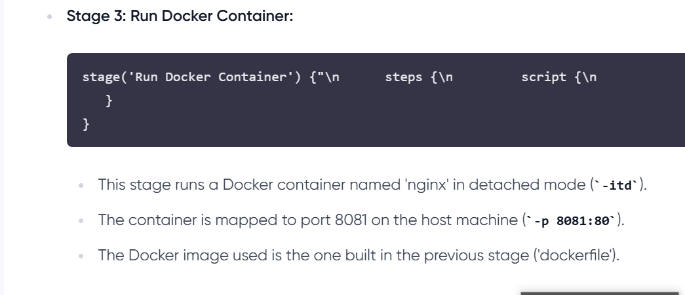

To generate syntax for the machine

`checkout scmGit(branches: [[name: '*/main']], extensions: [], userRemoteConfigs: [[url: 'https://github.com/richard-ukpabi/jenkins-scm']]`

### Instaling docker on the same instance with Jenkins.

In order to run our docker image in jenkins, we need to have docker runnung on the same instance as jenkins. To do this we run the command.

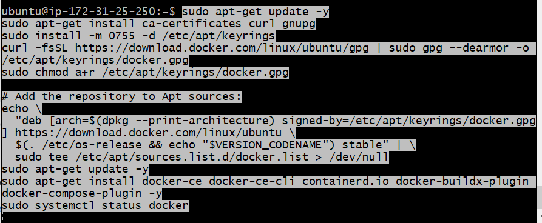

2. Making the file executable, we run the command
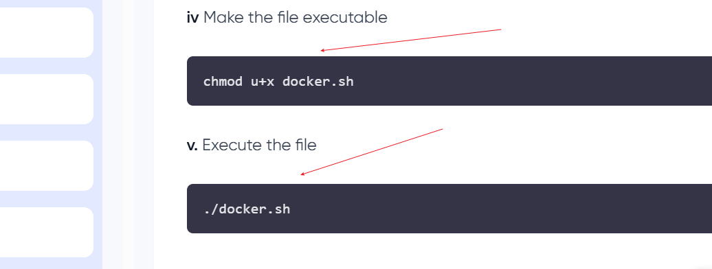

3. Execute the file by running the command
. This successfully install docker on our machine.

### Building the pipeline script.
In order for teh pipeline script to run, we need to create a docker file that will be picked by the job. Now because we are running an nginx web application, we will also create an index.html file with the instruction that will be executed. The copy command in the docker file will place the index.html file in the WORKDIR, where nginx is configured to pick working files.
1. Create a dockerfile. Go to the github and create a docker file with parametesr as shown
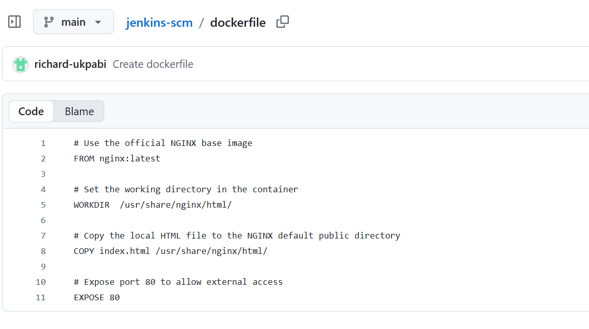

2. create the index.html file
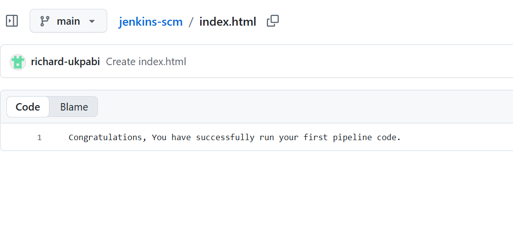

3. Add new rule in the aws comsole to be able to view the output of the container.
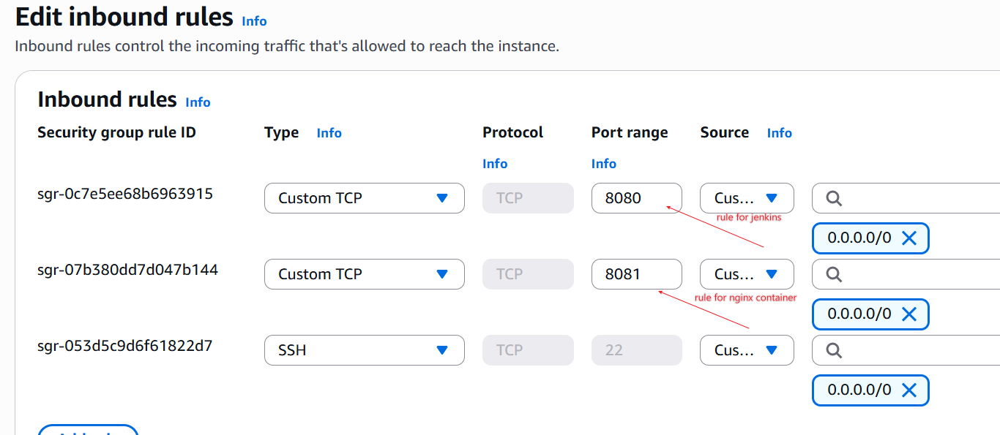

4. Edit the git code to allow pipeline take effect. The docker and jenkins file

5. Successfully ran job
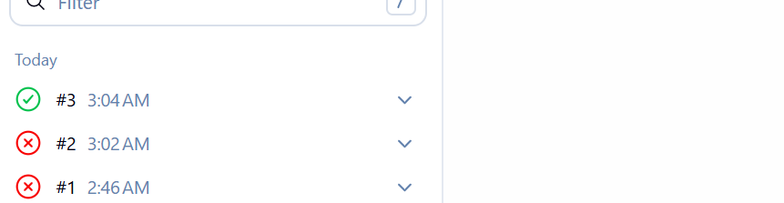 and the output of the job
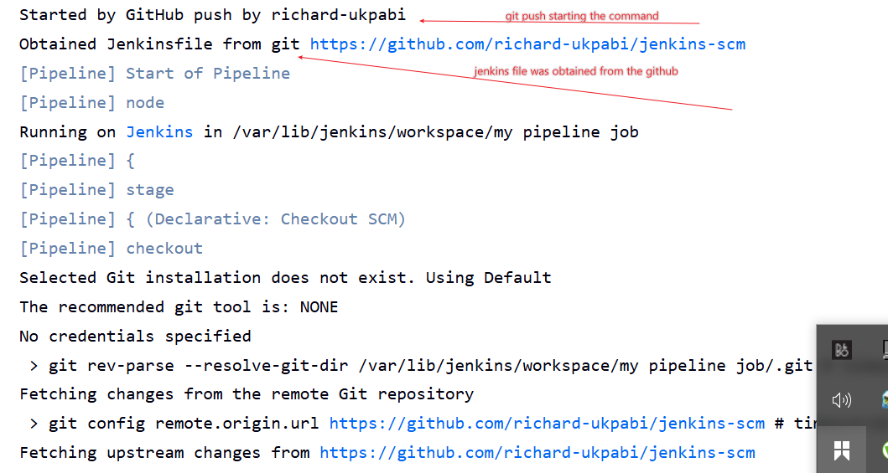

6. To access the content of our index.html file , we use the address http://`3.8.116.29:8081`
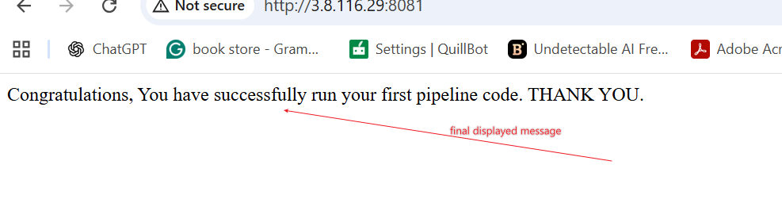

This marks the end of the project work.