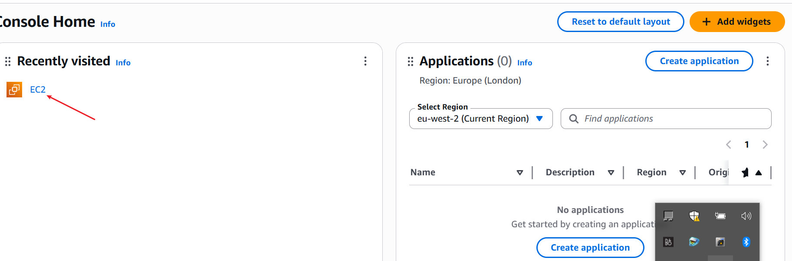
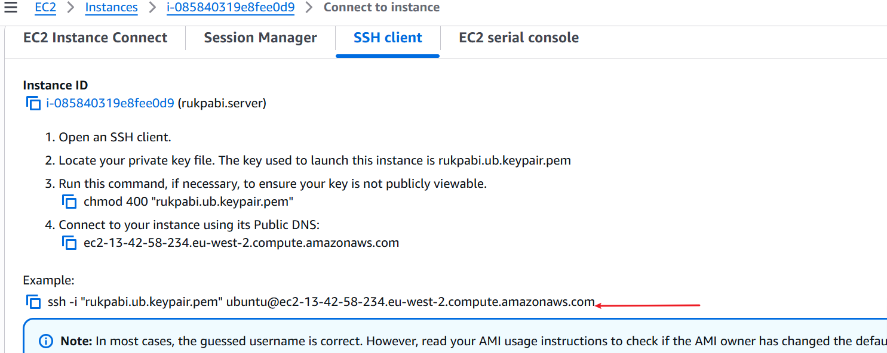
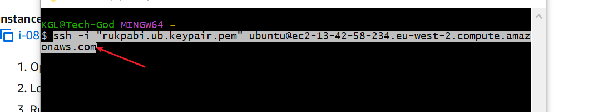
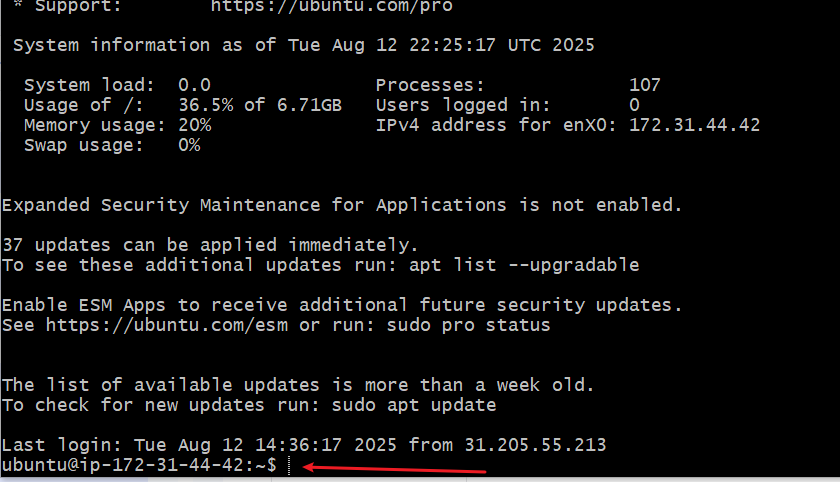
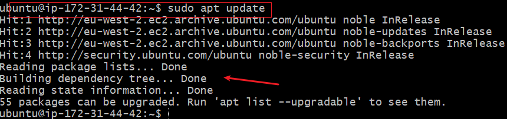
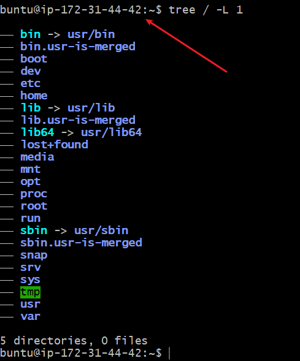
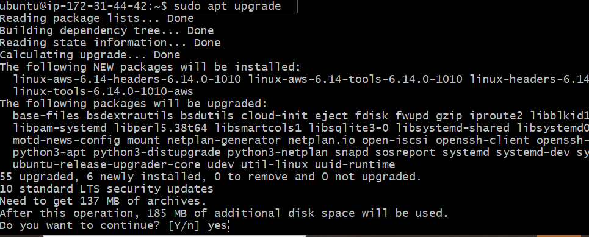
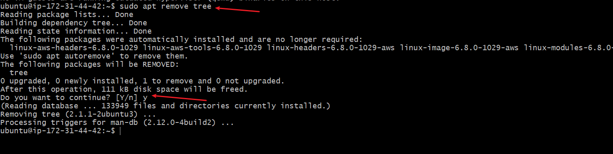

# LINUX FUNDAMETALS

The Essence of the project work is to equip candidate with a solid foundation in linux. 

1. CREATING AN EC2 INSTANCE
- AWS account setup and provisioning on Ubuntu server
- Connecting to your EC2 instance

The following picture images captures creating a EC2 Instance.

Once this is done, the SSH key is copied on the aws platform 

This is pasted on the terminal to create the connection to the aws server 

The pictures shows the terminal connected to the aws server
 & 

2. INSTALLING, UPDATING AND REMOVING SOFTWARE.

- Installing packages using sudo apt update command 

- Installing tree package    
command  /[installing tree command](./img/6.part-8.png)

- Verifying installed tree package

- Upgrading installed packages

- Removing software package
This is to remove the installed tree command
